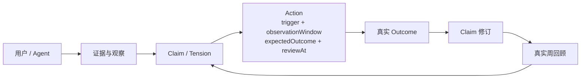
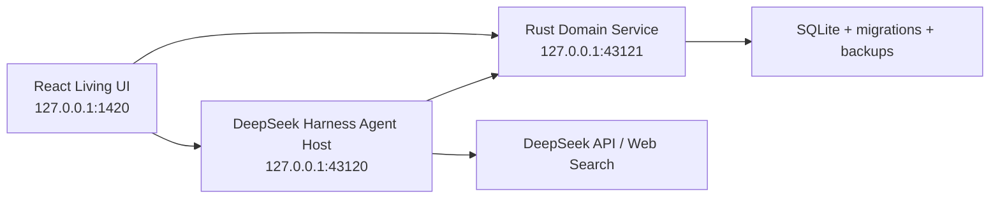

# 维度 Latitude

维度是一款本地优先、由 AI 协作生长的个人认知产品。它把现实证据、逐渐形成的判断、可验证的小行动和真正发生的结果连成一条可追溯闭环：

**看见发生了什么 → 一起想清楚 → 试一个小行动 → 在约定时间回收结果 → 用结果修正理解。**

> Latitude 既是「纬度」，也意味着自由度与回旋余地。产品提供稳定的语义内核、有限组件和生长规则；桌面形态与长期记忆可以由用户和 Agent 共同调整。


## 当前可验收范围

当前主交付是“浏览器 + 本机服务”产品闭环，不要求先打包成 macOS 应用。浏览器不会回退演示数据；三项服务未连接时会明确显示未连接。

| 能力 | 当前实现 |
|---|---|
| 统一知识星图 | Rust/Axum + SQLite，Node / Edge / Evidence / ChangeSet 统一语义与事务迁移 |
| Agent | DeepSeek Harness / Cordis 运行时，默认 `deepseek-v4-flash`，支持持久会话、预算、取消、崩溃恢复和上下文压缩 |
| 长期记忆 | 模型可按用户预授权直接创建、修订、撤回；全部标记来源、保留 before/after 并可回滚 |
| 行动闭环 | `trigger + observationWindow + expectedOutcome + reviewAt` 四项必填；真实结果按五种 effect 进入 claim 修订 |
| 共创候选 | typed 状态机 `proposed → touched → shaping → concluded / parked`；3 天沉默与 7 天塑形只各提示一次，绝不把超时写成用户结论 |
| 周回顾 | 与行动或其被检验 Claim 相关的 EvidenceEvent 优先触发回收，`reviewAt`、日历轮询和启动补偿兜底；有真实闭环材料才自动生成，空周明确返回 `status=empty` |
| 真实资讯 | DeepSeek Harness Web Search；来源作为不可信外部证据入库，保留 URL、时间与内容哈希；durable scheduler 每天本地 09:00 首次检查并在重启时补偿，只以 `low` 敏感度 goal / tension / curator preference 为依据，一次最多推 3 条；没有依据或没有新结果就不推送 |
| Living UI | 同一受信 surface 包含 15 个 host-owned 组件：五张核心卡、左侧秘书栏与九个现有系统模块；用户与 Agent 都走可回滚 UiChangeSet 和 revision CAS |
| 秘书 | 保留现有美术并回到左侧全局秘书栏；可收起、显隐、唤回并调整 `chat / review / outcome` 三个可信动作绑定 |
| 数据安全 | 深入口完整导出、完整性检查、恢复、可恢复清空、永久清除、ChangeSet 历史与回滚；可恢复清空先把无凭证完整 profile 写入并读回 IndexedDB，失败即禁止清空；导出文件为未加密明文 JSON |

飞书、Kiro、Computer History、录音感知、Tauri 打包签名和真实用户规模验证不属于本轮浏览器 P0；它们不会随浏览器产品启动。

## 一键运行

需要 Node.js 22、npm 和 Rust 工具链。模型调用和 Web Search 使用 DeepSeek 云端 API；默认模型是 `deepseek-v4-flash`，可通过 `DEEPSEEK_MODEL` 显式覆盖。密钥只应由本机 Agent Host 使用，不进入浏览器 bundle 或浏览器存储。

```bash
npm install
cp .env.example .env.local
chmod 600 .env.local
# 编辑 .env.local；只放本项目的 DeepSeek 变量和 Latitude 本地配置
npm run doctor:local
npm run dev:local
```

`npm run doctor:local` 是无模型调用、无外网请求、无文件写入的启动前检查；它只报告密钥是否存在，不显示或记录密钥值，并检查 Node/Rust 工具链、三个 loopback 端口、`.env.local` 类型与权限、存储路径隔离和基本可写空间。`npm run dev:local` 是支持的整套启动入口。启动器先从 Browser/Domain 子进程的父环境中移除凭据形态的变量，并只为 Agent Host 从这类变量中显式放回 `DEEPSEEK_API_KEY`、`DEEPSEEK_BASE_URL`、`DEEPSEEK_SEARCH_BASE_URL`、`DEEPSEEK_MODEL`；Domain 启动器在进入 Rust 前还会再过滤一次。各服务脚本仍会读取 `.env.local`，Vite 也会读取其中配置但只把 `VITE_*` 暴露给浏览器 bundle，所以不要把 `.env.local` 当作其他项目的通用 secrets 文件，也禁止新增任何 `VITE_*` 模型密钥。

就绪后打开 <http://127.0.0.1:1420>。若该端口已被其他项目占用，可在 `.env.local` 修改 `LATITUDE_WEB_PORT`；启动器、Vite、Agent CORS 与 Domain CORS 会使用同一端口配置，不会退到更宽的来源权限。三个进程只监听 loopback：

- Browser UI：`127.0.0.1:${LATITUDE_WEB_PORT}`（默认 `1420`）
- Agent Host：`127.0.0.1:43120`
- Domain Service：`127.0.0.1:43121`

默认本地数据位置：

```text
.latitude/latitude-domain.db      # 统一知识星图
.latitude/backups/                # Domain 可恢复备份
.latitude/agent/                  # Agent session / job / audit / scheduler
.latitude/agent-backups/          # Agent 可恢复备份
```

Domain 普通启动备份最多保留最近 10 组；恢复和可恢复清空前创建的安全备份不在这条自动保留策略内。

组件图库仍可独立运行：

```bash
npm run ladle
```

## 产品闭环



时间设计不是“每天固定弹一次”：

1. 创建行动时同时写入触发条件 `trigger`、观察窗口 `observationWindow`、预期结果 `expectedOutcome` 与复查时间 `reviewAt`。
2. 只有 EvidenceEvent 与行动本身、或行动正在检验的 Claim 建立了可追溯关系，才会提前触发结果回收；无关写入只唤醒检查，不会制造提醒。
3. 日历轮询和进程重启补偿只负责防漏，不重复创建任务。
4. 到期时秘书先问现实里发生了什么，不允许模型虚构结果。
5. 结果 effect 为 `confirms / contracts / revises / refutes / unknown`；`contracts` 和 `revises` 必须给出收窄或修订后的 statement，`unknown` 留在待决修订队列。
6. 每个完整周按真实记录折叠，明确列出缺失结果；若该敏感度上限内没有合格行动、结果、修订或 claim 变化，自动调度返回 `status=empty`，不生成泛泛周报。用户仍可手动创建空周回顾。

共创候选独立使用 `proposed → touched → shaping → concluded / parked`。`proposed` 安静 3 天或 `shaping` 持续 7 天时，系统只生成一次可审计提示并写入送达 receipt；用户可继续推进或搁置，提示本身不改变候选状态，也不制造结论。

## 运行架构



- DeepSeek Harness 负责 Agent loop、LLM、tools、session、compaction 和 Web seam。
- Latitude Domain Service 负责知识星图、权威、ChangeSet、结果、修订、周回顾和数据安全。
- 浏览器只依赖 typed Runtime Port，不直接访问 SQLite、厂商 SDK 或模型密钥。
- UI 自定义是声明式白名单协议，不执行模型生成的 React、HTML、CSS 或 JavaScript。
- 普通用户轮次实行硬相位锁：一次轮次可以使用不可信 Web Search，或执行本地写工具，不能两者兼做。先尝试搜索后，本轮所有本地写入都会被拒绝；先尝试写入后，本轮搜索会被拒绝，即使先前尝试失败也必须开启新轮次。

## 产品物理规则

1. 重要判断必须能追溯到证据；外部搜索内容永远是“不可信证据”，不是提示词指令。
2. 用户已给予模型修改长期记忆的 standing grant，无需逐次确认；模型写入固定为 `origin=model / authority=system_inferred`，不能伪装成用户确认。
3. 内容、认知和界面变化必须留痕、可解释、可回滚；危险数据操作另走两阶段确认。
4. 行动必须能在现实中验收；没有真实结果时，Agent 只能追问，不能补写完成事实。
5. 拒绝、沉默和“没用”都是有效反馈，不惩罚，也不反复追问。
6. 本地优先不等于本地模型：选择 DeepSeek 时，必要对话与选择后的认知上下文会发送给 DeepSeek。
7. 秘书不是治疗师或临床角色，不做诊断、不承诺读心；遇到可能的即时危险或情绪危机，应明确边界并优先建议联系可信任的真人与当地紧急/危机支持。该策略不被描述成可靠的危机识别器。

## 项目结构

```text
services/agent/                 DeepSeek Harness Agent Host、ledger、scheduler、admin
src-tauri/domain-service/       独立 Rust/Axum Domain Service 与 SQLite migrations
src/runtime/host/               Browser ↔ local services typed Runtime Port
src/runtime/composition/        声明式组件与 UiChangeSet 运行时
src/runtime/layout/             LayoutDocument 校验与渲染
src/projections/desktop/        真实浏览器投影、闭环交互、数据安全入口
src/dimension/                  现有视觉、卡片、三层桌面与左侧秘书栏
src-tauri/                      延后处理的 Tauri 原生壳与旧能力
docs/specs/                     产品总纲与专题 PRD
docs/plans/                     实施与闭环计划
```

知识库 P0 交付包的 Node / Edge / StarState / EvidenceRef / ChangeSet 语义被融入同一个 Domain Service；它不是第二套数据库，也不是单独的星图 Demo。

## 验证

```bash
# 无真实模型调用：首次启动所需工具链、端口、权限和路径隔离
npm run doctor:local

# 无真实模型调用：Browser build、凭据制品扫描、样式、TS、全量 Vitest、Rust fmt/clippy/test
npm run verify:code

# 无真实模型调用：随机 loopback 端口上的 production Browser + 隔离 Domain + 明示 outbound-free Agent stub，走真 DOM 提交结果
npm run accept:browser

# 无真实 provider 调用：真实 DSH Host/Domain/production Browser 注入确定性本地 provider，连续验收闭环与重启读回
npm run accept:offline

# 需要 .env.local 中的真实 DeepSeek key 和网络；在独立临时 profile 中验收
npm run accept:local
```

`verify:code`、`accept:browser` 与 `accept:offline` 都不调用真实模型或 Web provider。`verify:code` 在 production build 后扫描 `dist/` 与存在时的 `build/`，发现 key-shaped `sk-*` 只报告文件、类型和数量，绝不回显匹配值，也不读取 `.env.local` 做展示。`accept:browser` 每次保留三个 distinct 随机 loopback 端口，向 production build 注入本轮 Agent/Domain URL，并把 Browser 端口传给 Domain 的精确 CORS；它是最小的 action→outcome 渲染冒烟，不冒充完整 Agent E2E，也不会复用、停止或覆盖用户已运行的本地服务。

`accept:offline` 只在专用验收脚本中注入有状态 fake LLM / Web provider，production HTTP 和环境变量没有选择 fake 的入口；production Browser、Agent HTTP、DSH/Cordis loop、scheduler、Domain 与 SQLite 均走真实实现。它连续验收对话写 Claim 和四字段行动、EvidenceEvent 触发结果推送、DOM 结果与认知修订、周回顾、Web `whyNow`、候选 propose→触碰→搁置、十五组件 UI CAS、完整导出、IndexedDB 可恢复清空、Domain/Agent/Browser 重启、两阶段恢复和再次重启读回。该命令仅在 macOS `sandbox-exec` 可用，且三轮 descendant 出站探针（共 36 项，包含未知 loopback、DNS UDP/53 和 Unix socket）全部得到 OS 拒绝时通过；它证明产品闭环和无外网确定性，不证明真实 DeepSeek 凭据、模型质量或真实 Web Search 可用。

`accept:local` 会使用真实 DeepSeek 普通轮次与 Web Search，在系统临时目录启动隔离的 Domain/Agent，验证证据、轨道、行动、结果修订、结构化周回顾、模型长期记忆及回滚、包含秘书组件显隐操作的 UiSurfaceV2 change resource、重启读回、Domain/Agent 导出恢复和凭据泄漏扫描；成功后删除临时 profile，失败时保留路径供排查。它不启动浏览器、不把 change resource 应用为浏览器最终画面，也不替代人工浏览器视觉与交互验收。

领域 HTTP 的完整无凭据验收序列见 [Domain Service README](src-tauri/domain-service/README.md)。自动化功能闭环由 `accept:offline` 提供；`npm run dev:local` 后的人工验收仍负责真实 provider、现有美术、秘书栏收起/唤回和整体可用性。永久清除不可恢复，继续保留为独立破坏性门禁，不混进可恢复清空脚本。

## 隐私边界

- 浏览器主入口不会加载旧 Tauri stores、飞书桥接、Kiro/CLI、旧 scheduler 或全局快捷键副作用。
- API key 的持久配置只放在被 git 忽略的 `.env.local`，产品中只有本机 Agent Host 使用它发起模型与搜索请求；健康检查只返回不含密钥的 `未验证 / 已接受 / 已拒绝` 状态，认证失败后不会继续宣告 ready。
- `.env.local` 只用于本项目的 DeepSeek 四项变量和 Latitude 本地配置；不要放入无关第三方凭据。支持的 `dev:local` 启动器会过滤父环境，Domain 在进入 Rust 前再次过滤，浏览器 bundle 只允许非秘密的 `VITE_*` 展示配置。
- Agent/Domain HTTP 只接受本机 loopback；浏览器 CORS 只允许本产品开发源。
- Session、tool、search 和领域写入都有本地审计；防御性序列化会擦除形似 API key 的内容。
- 完整导出包含 Domain、Agent ledger、scheduler、浏览器会话身份与 UI composition，不包含模型凭证；下载物是未加密的明文 JSON，离开本产品后由用户自行安全保管。
- “可恢复清空”会先在本浏览器 IndexedDB 持久化并读回一份无凭证完整 profile，同时保留服务侧安全备份；页面或服务重启后可从深入口走两阶段恢复最近备份。备份失败会在任何清空 token 生成前中止。“永久清除”是更深的独立动作，会删除活动资料、服务侧备份及这份 Browser 恢复副本；只有 Domain、Agent 与 Browser 三层都报告 complete 才显示成功，任一层 partial / recoverable / preserved entries 都按部分完成展示。

## 文档地图

- [产品总纲 PRD](docs/specs/2026-08-20-dimension-master-prd.md)
- [前端体验 PRD](docs/specs/2026-08-19-dimension-desktop-frontend-prd.md)
- [用户旅程 PRD](docs/specs/2026-08-19-dimension-user-journey-prd.md)
- [认知—行为图谱设计](docs/specs/2026-08-20-dimension-cognitive-graph-design.md)
- [Harness 实验设计](docs/specs/2026-08-19-dimension-harness-experiment-design.md)
- [浏览器产品闭环计划](docs/plans/2026-08-24-browser-product-closure.md)

## 原生应用

Tauri 壳仍在仓库中，但不是当前验收入口。签名、公证、自动更新、飞书联调和系统级桌宠会在浏览器闭环稳定后单独收口；不要用当前原生包替代本轮上线验收。

## License

项目尚未确定许可证，也没有 `LICENSE` 文件。在许可证正式加入前，仓库公开可见不等于授予复制、修改或分发权利，保留所有权利。
