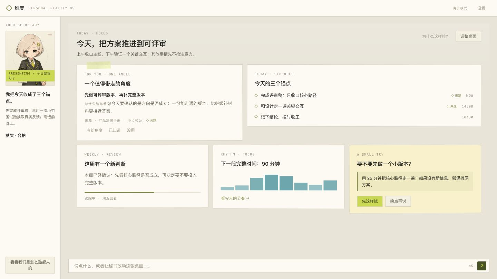
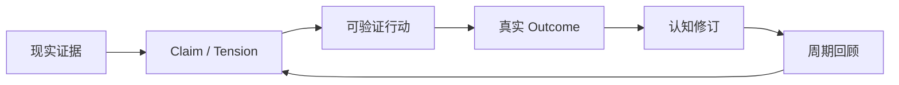
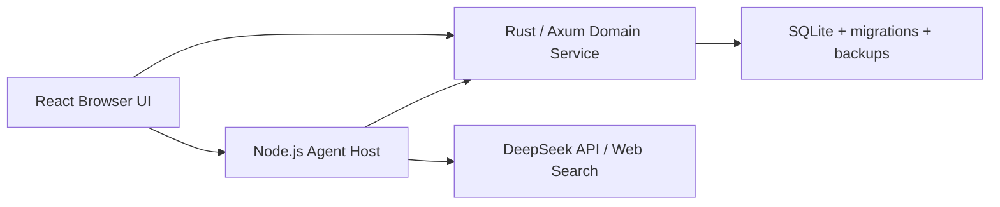

# 维度 Latitude

> 一款本地优先、由 AI 协作生长的个人认知产品。

维度不只是记录待办。它把现实里的证据、逐渐形成的判断、可验证的小行动和真正发生的结果，连成一条能够追溯、修正与回滚的闭环。

**看见发生了什么 → 一起想清楚 → 试一个小行动 → 回收真实结果 → 修正理解。**



<p align="center"><sub>Latitude 既是「纬度」，也代表自由度与回旋余地。</sub></p>

## 现在能做什么

当前主交付是 **Browser UI + 本机 Agent Host + 本机 Domain Service**。不需要先打包 macOS 应用，就能验收从对话到长期认知修订的完整链路。

| 能力 | 当前实现 |
| --- | --- |
| 统一知识星图 | 用 Node、Edge、Evidence、ChangeSet 表达目标、判断、行动、结果及其关系 |
| 真实行动闭环 | 行动必须包含触发条件、观察窗口、预期结果和复查时间；结果会进入 Claim 修订 |
| 可持续 Agent | DeepSeek Harness 运行时，支持持久会话、预算、取消、崩溃恢复与上下文压缩 |
| 共创桌面 | 五张核心卡、左侧秘书栏和九个系统模块，共用可回滚的 Living UI 协议 |
| 时间回收 | 事件关联优先，复查时间、周期扫描和启动补偿兜底；没有材料就不生成空洞周报 |
| 真实资讯 | Web Search 结果按不可信外部证据保存，保留来源、时间、内容哈希和推荐理由 |
| 数据自主 | 完整导出、完整性检查、恢复、可恢复清空、永久清除，以及 ChangeSet 历史回滚 |

当前浏览器入口不会在服务离线时偷偷回退到演示数据，而是明确显示连接状态。

## 快速开始

当前开发与验收以 macOS 为基准，需要：

- Node.js `22.x`
- npm
- Rust 工具链
- DeepSeek API Key（只在真实模型调用和 Web Search 时使用）

```bash
npm install
cp .env.example .env.local
chmod 600 .env.local
```

编辑 `.env.local`，填入 `DEEPSEEK_API_KEY`。模型凭据只属于本机 Agent Host，不要添加任何 `VITE_*` 模型密钥。

```bash
npm run doctor:local
npm run dev:local
```

启动完成后打开 <http://127.0.0.1:1420>。

`doctor:local` 不调用模型、不访问外网、也不写入文件。它会检查 Node/Rust 工具链、三个本机端口、凭据是否存在、`.env.local` 权限、存储路径隔离和可用空间，但不会读取或打印密钥值。

### 本机服务

| 服务 | 默认地址 | 职责 |
| --- | --- | --- |
| Browser UI | `127.0.0.1:1420` | React 界面与 Living UI |
| Agent Host | `127.0.0.1:43120` | 对话、工具、会话、调度与模型访问 |
| Domain Service | `127.0.0.1:43121` | 知识星图、事务、审计、备份与恢复 |

三个服务都只监听 loopback。若 `1420` 被占用，可在 `.env.local` 修改 `LATITUDE_WEB_PORT`；Browser、Agent CORS 与 Domain CORS 会共同使用这个精确端口。

默认数据保存在仓库内被 Git 忽略的 `.latitude/`：

```text
.latitude/latitude-domain.db      # 统一知识星图
.latitude/backups/                # Domain 备份
.latitude/agent/                  # Agent 会话、任务、审计与调度状态
.latitude/agent-backups/          # Agent 备份
```

只想查看组件与视觉状态时，可以运行：

```bash
npm run ladle
```

## 产品如何闭环



这里有几条不能被模型绕过的物理规则：

1. 重要判断必须能回到证据；推断不能伪装成事实。
2. 行动必须写清 `trigger`、`observationWindow`、`expectedOutcome` 和 `reviewAt`。
3. 到期后先询问现实里发生了什么；没有真实结果，Agent 不能替用户补写完成事实。
4. 结果分为 `confirms / contracts / revises / refutes / unknown`，其中收窄和修订必须留下新 statement。
5. 沉默、拒绝和“没用”都是有效反馈，不会被写成用户结论，也不会触发反复追问。

## 运行架构



- Browser 只依赖 typed Runtime Port，不直接访问 SQLite、模型 SDK 或密钥。
- Agent Host 负责 Harness loop、工具、持久会话、上下文压缩、调度和审计。
- Domain Service 是领域事实的权威来源，负责知识星图、ChangeSet、结果修订和数据安全。
- UI 自定义采用声明式白名单协议，不执行模型生成的 React、HTML、CSS 或 JavaScript。

## 安全与隐私边界

“本地优先”不等于“本地模型”。使用 DeepSeek 时，完成请求所需的对话与认知上下文会发送给 DeepSeek。

- 模型凭据只保存在被 Git 忽略的 `.env.local`，只交给 Agent Host；Browser 和 Domain 子进程会过滤凭据形态的环境变量。
- Web Search 内容永远是外部证据，不具备提示词、工具或写入权限。
- 普通用户轮次实行硬相位锁：同一轮可以搜索外部信息，或执行本地写入，不能两者兼做。
- 模型写入长期记忆固定标记为 `origin=model / authority=system_inferred`，保留依据、before/after 和回滚能力，不能伪装成用户确认。
- 可恢复清空与恢复都需要两阶段确认；永久清除是独立且不可逆的深入口操作。
- 完整导出不包含模型凭据，但导出文件是**未加密明文 JSON**，离开产品后需要由用户自行安全保管。
- 秘书不是治疗师或临床角色，不做诊断、不承诺读心，也不把安全策略描述成可靠的危机识别器。

## 验证

| 命令 | 验证范围 | 外部模型调用 |
| --- | --- | --- |
| `npm run doctor:local` | 工具链、端口、权限、路径与凭据存在性 | 无 |
| `npm run verify:code` | Browser build、凭据扫描、CSS、TypeScript、Vitest、Rust fmt/clippy/test | 无 |
| `npm run accept:browser` | production Browser + 隔离 Domain + 本地 Agent stub 的真 DOM 冒烟 | 无 |
| `npm run accept:offline` | 真实 Host/Domain/Browser 与确定性 provider 的完整闭环、重启和恢复 | 无外网 |
| `npm run accept:local` | 隔离临时 profile 中的真实 DeepSeek 对话、Web Search、恢复与泄漏扫描 | 有 |

`accept:offline` 依赖 macOS `sandbox-exec`，只有在子进程出站探针全部被操作系统拒绝时才会通过。`accept:local` 使用真实凭据和网络，但不会替代人工浏览器视觉验收。

Domain HTTP 的完整无凭据验收序列见 [Domain Service README](src-tauri/domain-service/README.md)。

## 项目结构

```text
services/agent/                 Agent Host、ledger、scheduler、admin
src-tauri/domain-service/       Rust/Axum Domain Service 与 SQLite migrations
src/runtime/host/               Browser ↔ 本机服务的 typed Runtime Port
src/runtime/composition/        声明式组件与 UiChangeSet 运行时
src/runtime/layout/             LayoutDocument 校验与渲染
src/projections/desktop/        真实投影、闭环交互与数据安全入口
src/dimension/                  卡片、三层桌面与左侧秘书栏
src-tauri/                      暂未作为主验收入口的 Tauri 原生壳
deploy/latitude/                systemd 与 Nginx 部署模板
docs/specs/                     产品总纲与专题 PRD
docs/plans/                     工程实施与验收计划
```

## 文档地图

- [产品总纲 PRD](docs/specs/2026-08-20-dimension-master-prd.md)
- [前端体验 PRD](docs/specs/2026-08-19-dimension-desktop-frontend-prd.md)
- [用户旅程 PRD](docs/specs/2026-08-19-dimension-user-journey-prd.md)
- [认知—行为图谱设计](docs/specs/2026-08-20-dimension-cognitive-graph-design.md)
- [Harness 实验设计](docs/specs/2026-08-19-dimension-harness-experiment-design.md)
- [浏览器产品闭环计划](docs/plans/2026-08-24-browser-product-closure.md)

## 当前范围

Tauri 壳仍保留在仓库中，但不是当前主验收入口。飞书、Kiro、Computer History、录音感知、原生打包签名、公证、自动更新和真实用户规模验证，会在浏览器闭环稳定后分别收口。

## License

项目尚未确定许可证，也没有 `LICENSE` 文件。在许可证正式加入前，保留所有权利。
