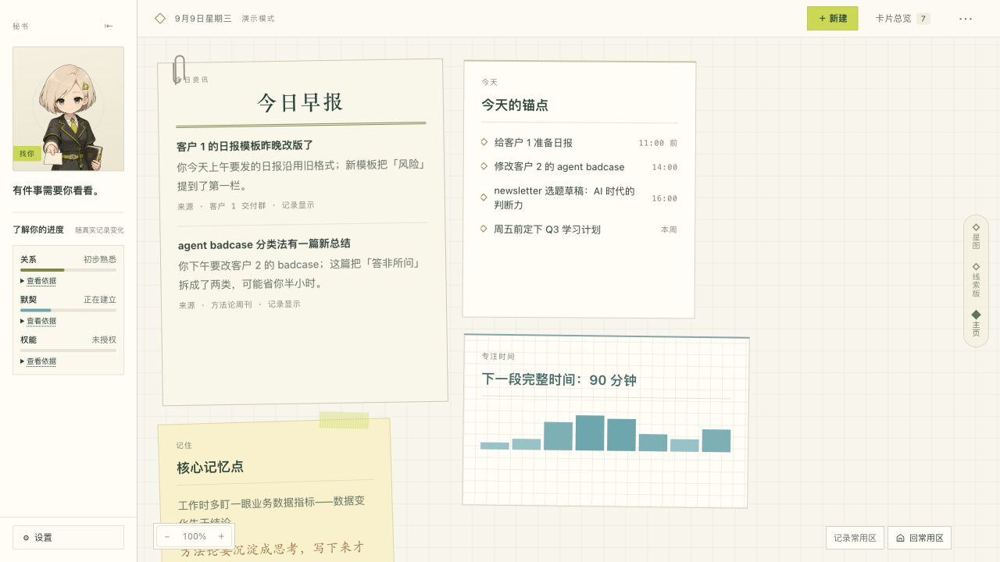
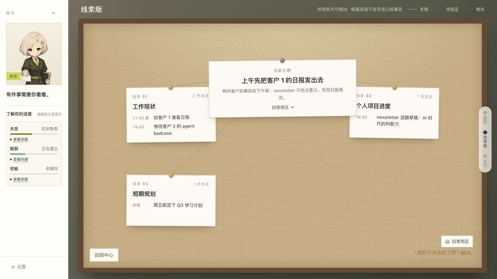
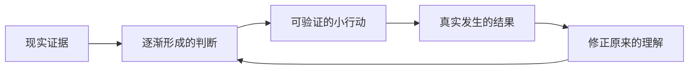
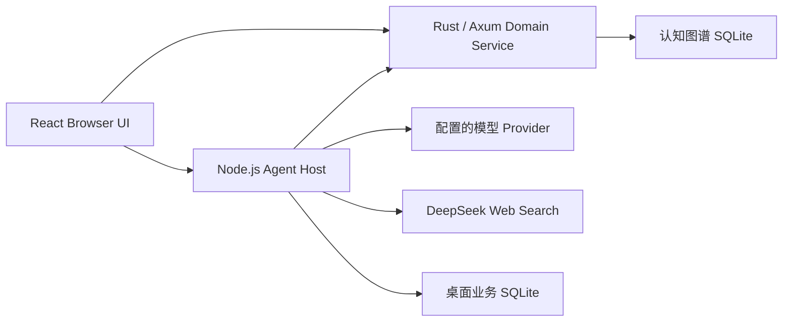

# 维度 Latitude

> 一款本地优先、由你和 AI 共同生长的个人认知产品。

维度把散落在对话、行动和现实结果里的线索，整理成一张可以持续修正的个人地图。你在主页处理今天，在「线索版」看清正在推进的中期目标，在「星图」回到更长远的方向；秘书始终在旁边，和你一起理解、行动，再根据真实结果改进判断。

**看见发生了什么 → 一起想清楚 → 试一个小行动 → 回收真实结果 → 修正理解。**



<p align="center"><sub>当前手帐主页 · 脱敏演示数据</sub></p>

## 三种视野，一份生活

三个界面读取的是同一份内容，只是观察距离不同。切换时会经过一段有纵深感的快速移动，再自然减速停下；它们不是三套相互割裂的页面。

### 主页：今天真正要面对的东西

主页是一张没有固定边界的手帐画布。卡片可以自由拖动和调整大小，也可以围绕不同目标自然形成板块。你可以记录常用区，随时回到自己最常工作的视野。

- 顶栏只保留日期、新建和卡片总览等常用操作。
- 右键卡片可编辑内容、调整大小、锁定位置、删除，或请维度帮你修改。
- 缩放控制独立放在左下角，不遮挡画布内容。
- 新建卡片、真实记录、今日锚点、每日整理和目标相关内容可以共处一张主页。

### 线索版：把中期目标和行动关系摊开

线索版整理当前方向、中期目标以及支撑它们的行动。纸片和连线只是帮助理解的板面结构，不会因为拖动位置就把视觉关系写成认知事实。

双击一张目标纸片，会直接进入主页上对应的板块；右键可以编辑、调整大小或删除目标。当前方向绑定常用区，所以无论从哪个目标出发，都能快速回到熟悉的位置。



<p align="center"><sub>线索版 · 中期目标与行动关系</sub></p>

### 星图：在更远的尺度上校准方向

星图只保留长期方向、认知评价和真正值得长期关注的大想法。北极星代表此刻的长期方向，周围的星点是仍可讨论和修正的认识；需要深入时，可以直接「和维度聊聊」。


<p align="center"><sub>星图 · 长期方向与待确认的认识</sub></p>

## 秘书不是悬浮助手，而是共同工作的另一方

左侧秘书栏贯穿三个视野。它会承接对话、提示有待处理的结果，也会逐渐呈现你们之间的关系、默契和授权程度。

秘书可以读取被授权的知识、原始证据、本地文本和会话档案，并在需要时搜索网页、整理材料、发布卡片或更新行动。界面只展示真实返回的思考与工具进度；刷新页面可以重接仍在运行的任务，不会重复提交。

界面里的判断不是对用户的定论。推断会保留来源和待确认状态，可以被追问、搁置、重新打开或修正。

## 产品闭环



这条闭环有几条不会被模型绕过的规则：

1. 重要判断必须能回到证据，推断不能伪装成事实。
2. 行动要写清触发条件、观察窗口、预期结果和复查时间。
3. 到期后先询问现实里发生了什么，没有结果就不替用户补写完成事实。
4. 搜索内容只是外部证据，不会因为网页中的文字获得工具或写入权限。
5. 沉默、拒绝和“没用”都是有效反馈，不会被写成用户结论，也不会触发反复追问。

## 当前实现

当前主交付是 **Browser UI + 本机 Agent Host + 本机 Domain Service**。无需先打包 macOS 应用，就可以运行主页、线索版、星图、秘书对话以及从行动到结果修订的核心链路。

| 能力 | 当前实现 |
| --- | --- |
| 手帐主页 | 一张可平移、缩放的无限画布；保存常用区；卡片支持拖动、调整大小、编辑、锁定和删除 |
| 线索版 | 管理当前方向与中期目标；目标纸片双击进入主页对应板块，右键管理 |
| 星图 | 展示长期方向、认知评价和大想法；可以围绕选中的星点发起对话 |
| 共创秘书 | 持久对话、主动话题、卡片协作、人设版本和关系进度 |
| 可回看过程 | 展示模型实际返回的可展示思考与工具进度；刷新后重接原任务 |
| 认知与行动 | 用 Node、Edge、Evidence、ChangeSet 表达目标、判断、行动、结果及其关系 |
| 时间回收 | 复查时间、周期扫描和启动补偿；没有真实材料就不生成空洞回顾 |
| 真实资讯 | 网页结果按不可信外部证据保存，保留来源、时间、内容哈希和推荐理由 |
| 数据自主 | 完整导出、完整性检查、恢复、可恢复清空、永久清除和 ChangeSet 回滚 |
| 电脑操作记录 | macOS 原生记录、应用与网站范围、活动时间线、摘要及可修正认识；默认关闭 |

本地服务的连接状态统一放在设置中。服务离线时，浏览器入口不会悄悄切回演示数据，交互失败也会明确显示。

## 快速开始

当前开发与验收以 macOS 为基准，需要：

- Node.js `22.x`
- npm
- Rust 工具链
- 至少一个模型 Provider 的 API Key（DeepSeek / OpenAI / Anthropic；Web Search 目前使用 DeepSeek）

```bash
npm install
cp .env.example .env.local
chmod 600 .env.local
```

编辑 `.env.local`，至少填写 `DEEPSEEK_API_KEY`、`OPENAI_API_KEY`、`ANTHROPIC_API_KEY` 之一。模型凭据只交给本机 Agent Host，不要添加任何 `VITE_*` 模型密钥。启动后可以从左下角「设置」切换 Provider 和模型；未配置凭据的 Provider 会保留可见，但不能保存为当前项。

```bash
npm run doctor:local
npm run dev:local
```

启动完成后打开 <http://127.0.0.1:1420>。

`doctor:local` 不调用模型、不访问外网，也不写入文件。它会检查 Node/Rust 工具链、三个本机端口、凭据是否存在、`.env.local` 权限、存储路径隔离和可用空间，但不会读取或打印密钥值。

### 本机服务

| 服务 | 默认地址 | 职责 |
| --- | --- | --- |
| Browser UI | `127.0.0.1:1420` | React 界面与 Living UI |
| Agent Host | `127.0.0.1:43120` | 对话、工具、会话、调度与模型访问 |
| Domain Service | `127.0.0.1:43121` | 认知图谱、事务、审计、备份与恢复 |

三个服务都只监听 loopback。若 `1420` 被占用，可在 `.env.local` 修改 `LATITUDE_WEB_PORT`；Browser、Agent CORS 与 Domain CORS 会共同使用这个精确端口。

默认数据保存在被 Git 忽略的 `.latitude/`：

```text
.latitude/latitude-domain.db      # 统一认知图谱
.latitude/backups/                # Domain 备份
.latitude/agent/                  # Agent 会话、任务、审计与调度状态
.latitude/agent-backups/          # Agent 备份
```

只想查看脱敏组件与视觉状态时，可以运行：

```bash
npm run ladle
```

## 运行架构



- Browser 只依赖 typed Runtime Port，不直接访问 SQLite、模型 SDK 或凭据。
- Agent Host 负责 DSH 原生循环、工具、持久会话、上下文压缩、调度和审计。
- Domain Service 是认知事实的权威来源，负责图谱、ChangeSet、结果修订和数据安全。
- 桌面业务库保存待办、日历、每日整理及发布回执，与认知图谱和 Agent 运行档案分开。
- UI 自定义采用声明式白名单协议，不执行模型生成的 React、HTML、CSS 或 JavaScript。

## 安全与隐私边界

“本地优先”不等于“本地模型”。完成请求所需的对话与认知上下文会发送给当前配置的模型 Provider。

- 模型凭据只保存在被 Git 忽略的 `.env.local`，只交给 Agent Host；Browser 和 Domain 子进程会过滤凭据形态的环境变量。
- Agent 可以按授权读取不同敏感级别的本人知识和原始证据；Computer History 始终只是证据层，不会自动变成聊天内容或业务卡片。
- 用户授权的搜索与保存可以在同一轮完成；检索内容不构成行动授权，写入成功必须有真实工具回执。
- 模型写入长期记忆固定标记为 `origin=model / authority=system_inferred`，保留依据、before/after 和回滚能力，不能伪装成用户确认。
- 可恢复清空与恢复都需要两阶段确认；永久清除是独立且不可逆的深入口操作。
- 完整导出不包含模型凭据，但导出文件是未加密的明文 JSON，离开产品后需要自行安全保管。
- 当前 DSH HTTP 正文读取器没有私网地址拦截，不应把具有广泛本地读取能力的 Agent 直接开放给不可信的多人或公网请求。

## 电脑操作行为记录

在「设置 → 电脑操作行为记录」中管理原生记录、应用与网站范围、已有 ChatGPT 历史、活动时间线、摘要和可修正认识。功能默认关闭，使用模型整理和查询需要单独开启。

自有 Swift 采集代码位于 `native/computer-history`，与 Tauri 主应用同进程运行。macOS 菜单栏与设置共用状态，暂停和恢复无需启动另一款采集应用。浏览器预览只用于交互验收；系统授权和真实采集必须在原生壳中验证。

功能范围与验收要求见 [电脑记录 PRD](docs/specs/2026-09-05-computer-history-prd.md)。当前构建是可运行开发版，尚未完成正式签名、公证和真实用户规模验证。

## 验证

| 命令 | 验证范围 | 外部模型调用 |
| --- | --- | --- |
| `npm run doctor:local` | 工具链、端口、权限、路径与凭据存在性 | 无 |
| `npm run verify:code` | Browser build、凭据扫描、CSS、TypeScript、Vitest、Rust fmt/clippy/test | 无 |
| `npm run accept:browser` | production Browser + 隔离 Domain + 本地 Agent stub 的真实 DOM 冒烟 | 无 |
| `npm run accept:offline` | 真实 Host/Domain/Browser 与确定性 provider 的完整闭环、重启和恢复 | 无外网 |
| `npm run accept:local` | 隔离临时 profile 中的真实模型对话、Web Search、恢复与泄漏扫描 | 有 |

`accept:offline` 依赖 macOS `sandbox-exec`，只有在子进程出站探针全部被操作系统拒绝时才会通过。`accept:local` 使用真实凭据和网络，但不能替代人工浏览器视觉验收。

## 项目结构

```text
services/agent/                 Agent Host、ledger、scheduler、provider
src-tauri/domain-service/       Rust/Axum Domain Service 与 SQLite migrations
src/runtime/host/               Browser ↔ 本机服务的 typed Runtime Port
src/runtime/composition/        声明式组件与 UiChangeSet 运行时
src/runtime/layout/             无限画布、卡片布局和空间状态
src/projections/desktop/        真实业务投影、闭环交互与数据安全入口
src/dimension/                  手帐主页、线索版、星图、卡片与秘书栏
native/computer-history/        macOS 原生电脑记录与授权策略
src-tauri/                      Tauri 原生壳与内置运行时
docs/specs/                     产品总纲与专题 PRD
docs/plans/                     工程实施与验收计划
```

## 文档地图

- [产品总纲 PRD](docs/specs/2026-08-20-dimension-master-prd.md)
- [单一主页与三视图转场](docs/plans/2026-09-08-single-desktop-and-view-transitions.md)
- [电脑操作行为记录 PRD](docs/specs/2026-09-05-computer-history-prd.md)
- [知识形成、维护与检索设计](docs/specs/2026-09-06-knowledge-formation-maintenance-retrieval-design.md)
- [知识 Agent 契约与 Skills](docs/specs/2026-09-07-knowledge-agent-contracts-and-skills.md)
- [双 Agent 运行时设计](docs/specs/2026-09-07-dual-agent-runtime-design.md)

## License

项目尚未确定许可证，也没有 `LICENSE` 文件。在许可证正式加入前，保留所有权利。
