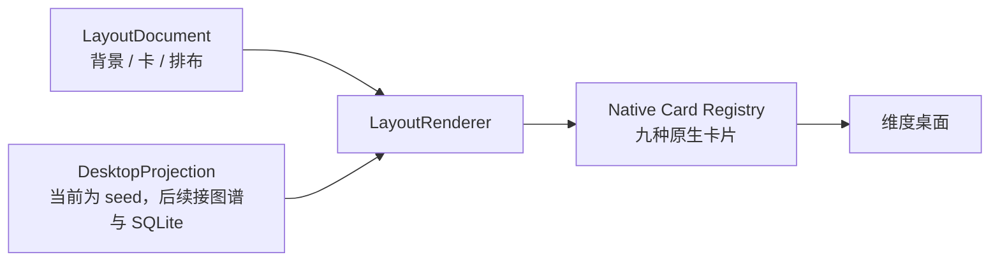

# 维度 Latitude

维度是一款 macOS 本地优先的 AI native 个人成长产品。

它不只管理待办，而是把现实中的证据、逐渐形成的判断和真正发生的行动连成一条可追溯的闭环：**看见发生了什么 → 一起想清楚 → 试一个小行动 → 用结果修正理解**。

> Latitude 既是「纬度」，也意味着自由度与回旋余地：产品提供有限的积木和生长规则，最终形态由每个人的使用长出来。


<p align="center"><sub>Seed demo · 示例数据，不代表已接入真实日程或认知图谱</sub></p>

## 当前状态

项目处于**种子实验阶段**。新的维度桌面已经以功能开关接入主窗口，但默认仍关闭；当前页面使用演示投影，用来验证布局、文案和交互，不会读取 SQLite、调用 LLM 或写入用户数据。

| 能力 | 当前状态 |
|---|---|
| 三层布局文档：背景 / 卡 / 排布规则 | 最小版本已实现 |
| `5 + 7 / 4 + 4 + 4` 五区桌面 | 已实现，使用演示数据 |
| 九种原生卡片、资讯反馈、血缘与提案动作 | 已实现 |
| 秘书 `3 状态 × 3 动作` 立绘与生长映射 | 已实现 |
| 主窗口功能开关与旧工作台回退 | 已实现 |
| Todo / Calendar → 新桌面的真实投影 adapter | 未接入 |
| 认知—行为图谱、共创流与 Proposal 持久化 | 未开工 |
| declarative / HTML 渲染 | 仅保留协议与安全降级，不执行 |

仓库中仍保留旧工作台积累的 Tauri 多窗口壳、SQLite、Engine Adapter、主动触达调度器、飞书管道和 MCP 等资产。它们会按工程计划逐步接入新产品，而不是被一次性改造成新架构。

## 本地预览

只看新桌面前端，不需要 Rust 环境。最快的组件预览方式是 Ladle：

```bash
npm install
npm run ladle
```

打开 <http://localhost:61000>，可以分别查看完整桌面、布局运行时，以及秘书的九动作与三档生长矩阵。

也可以从应用入口查看功能开关后的完整页面：

```bash
npm install
npm run dev
```

然后打开：

- 新维度桌面：<http://localhost:1420/?dimension=1>
- 旧工作台回退：<http://localhost:1420/?dimension=0>

也可以通过环境变量默认开启：

```bash
cp .env.example .env.local
# 将 VITE_DIMENSION_DESKTOP 改为 true
```

当前新桌面是演示模式。按钮会给出交互反馈，但不会把选择写入数据库。

## 运行原生应用

需要 macOS、Node.js、npm 和 Rust 工具链：

```bash
npm install
cp .env.example .env.local
npm run tauri:dev
```

LLM key 只在使用对应外部模型时需要配置。默认本地数据库位置：

```text
~/Library/Application Support/com.latitude.desktop/latitude.db
```

生产构建：

```bash
npm run tauri:build
```

## 桌面如何工作

维度桌面不是写死的一组 React 页面。布局与内容分开：布局文档决定背景、卡片与排布规则；桌面投影提供当前时刻的内容；渲染器把两者组合成稳定桌面。



种子骨架保持稳定：

- 上排左 `5`：资讯，每日最多三条，只展示与当前问题直接相关的异质视角。
- 上排右 `7`：日程，承接今天最高频的查看与行动。
- 下排 `4 + 4 + 4`：复盘·规划、节奏和弹性格；只有需要时才点亮。
- 对话条是自然语言编辑入口；未来所有布局变化都必须有理由、可预览、可撤销。

## 产品物理规则

以下是整个系统的目标约束；其中领域层与持久化门禁仍在建设中：

1. 重要判断必须能追溯到证据；推断必须明确标注为推断。
2. 写入长期记忆或认知模型前必须经过用户确认。
3. 内容、权限和形态变化必须留痕、可撤销、可回滚。
4. 拒绝与沉默都是有效反馈，不惩罚，也不反复追问。
5. 用户数据必须可完整导出、可彻底删除。

## 项目结构

```text
src/dimension/              新桌面视觉组件、卡片与秘书立绘
src/runtime/layout/         布局文档 schema、校验器与渲染器
src/projections/desktop/    桌面投影契约与当前演示投影
src/assets/secretary/       九动作秘书资源及使用约定
src/lib/                    旧资产与逐步迁移中的运行能力
src-tauri/                  Tauri 原生壳、命令与多窗口能力
docs/specs/                 产品总纲与专题 PRD
docs/plans/                 工程实施计划
```

## 路线图

1. **当前：种子运行时**——布局协议、native renderer、五区演示桌面与秘书资源。
2. **下一步：只读真实投影**——把现有 Todo / Calendar 接到日程与节奏区。
3. **完成种子实验**——补齐内容出场资格、共创回合、周回顾与两层导出。
4. **P0–P2**——冻结契约与迁移、修复全量测试基线、落地图谱与真实四象限桌面。
5. **后续**——叙事层、养成计算、授权治理、declarative / HTML 沙箱与可选感知插件。

## 开发与验收

```bash
# TypeScript + 前端生产构建
npm run build

# Vitest
npm test

# 组件与状态图库
npm run ladle
npm run ladle:build

# CSS 规则检查
npm run lint:styles
```

当前全量测试仍有两项旧基线债务：`ChatBar.test.tsx` 的 i18n mock 加载失败，以及 `tokens.test.ts` 对旧 token 格式的断言。新桌面切片的定向测试与生产构建已通过；完整门禁修复计划见[工程实施计划](docs/plans/2026-08-20-dimension-implementation-plan.md)。

## 文档地图

- [产品总纲 PRD](docs/specs/2026-08-20-dimension-master-prd.md)：产品定义、物理规则与系统架构的唯一上位口径。
- [桌面前端 PRD](docs/specs/2026-08-19-dimension-desktop-frontend-prd.md)：五区桌面、卡片、秘书与边缘状态。
- [用户旅程 PRD](docs/specs/2026-08-19-dimension-user-journey-prd.md)：第 0 天、日循环、周循环与月弧。
- [认知—行为图谱设计](docs/specs/2026-08-20-dimension-cognitive-graph-design.md)：领域模型、修订与投影边界。
- [Harness 实验设计](docs/specs/2026-08-19-dimension-harness-experiment-design.md)：种子实验、假设与结账标准。
- [工程实施计划](docs/plans/2026-08-20-dimension-implementation-plan.md)：资产复用、批次计划、测试与安全边界。

## 隐私边界

当前事实：

- 新桌面演示模式不读取数据库、不调用模型、不写入数据。
- 旧工作台业务数据保存在本机 SQLite；外部 LLM 仅在用户配置 provider 和 key 后使用。
- 选择云端 LLM 时，提示词及注入的上下文会发送给对应模型供应商；使用飞书时，相关内容会经过飞书服务。
- `.env.local`、本地数据库、音频与转写产物均由 `.gitignore` 排除。

尚未全部实现的产品目标：

- 无遥测、无自有业务服务端，并提供可审阅的完整导出与彻底删除。
- 录音、电脑使用轨迹等高敏感知插件默认关闭，显式授权，可随时撤销。
- Authority Grant、Action Ledger，以及提案—裁决—回滚链路完整落地。
- 完成开源卫生审计和真实用户 dogfood 前的知情同意流程。

## License

项目计划以开源形式发布，但当前尚未确定许可证，也没有 `LICENSE` 文件。在许可证正式加入前，仓库公开可见不等于授予复制、修改或分发权利，保留所有权利。
