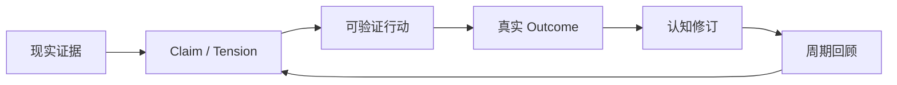
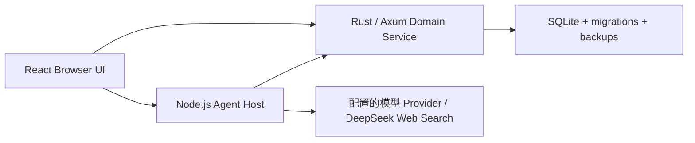

# 维度 Latitude

> 一款本地优先、由 AI 协作生长的个人认知产品。

维度不只是记录待办。它把现实里的证据、逐渐形成的判断、可验证的小行动和真正发生的结果，连成一条能够追溯、修正与回滚的闭环。

**看见发生了什么 → 一起想清楚 → 试一个小行动 → 回收真实结果 → 修正理解。**


<p align="center"><sub>Latitude 既是「纬度」，也代表自由度与回旋余地。</sub></p>

## 现在能做什么

当前主交付是 **Browser UI + 本机 Agent Host + 本机 Domain Service**。不需要先打包 macOS 应用，就能验收从对话到长期认知修订的完整链路。

| 能力 | 当前实现 |
| --- | --- |
| 统一知识星图 | 用 Node、Edge、Evidence、ChangeSet 表达目标、判断、行动、结果及其关系 |
| 真实行动闭环 | 行动必须包含触发条件、观察窗口、预期结果和复查时间；结果会进入 Claim 修订 |
| 可持续 Agent | DeepSeek Harness 原生循环、请求重试、压力驱动压缩；默认不设整轮时限/步数，支持用户取消与显式预算 |
| 可生长人设 | 默认 INFJ 灵感气质，支持对话或设置补充偏好；版本记录、恢复默认与恢复旧版 |
| 可回看的过程 | 实时展示模型实际返回的可展示思考与工具进度，正文单独整理；刷新重接原任务，不重复提交 |
| 手帐主页 | 一张可平移、缩放的无限画布，保存常用区；卡片支持拖动与右键调整大小、编辑、锁定和删除 |
| 线索版与星图 | 线索版管理中期目标，双击进入主页对应板块；星图呈现长期方向，三个视图通过连续转场连接 |
| 共创交互 | 左侧秘书栏承接对话，卡片可请维度协助修改；界面配置沿用可回滚的 Living UI 协议 |
| 时间回收 | 事件关联优先，复查时间、周期扫描和启动补偿兜底；没有材料就不生成空洞周报 |
| 真实资讯 | Web Search 结果按不可信外部证据保存，保留来源、时间、内容哈希和推荐理由 |
| 数据自主 | 完整导出、完整性检查、恢复、可恢复清空、永久清除，以及 ChangeSet 历史回滚 |

当前浏览器入口不会在服务离线时偷偷回退到演示数据；连接状态统一在设置中查看，交互失败会明确提示。

Agent 可按需查询所有敏感级别的本人知识和原始证据，翻页、读全文、读取本地文本资料及原始会话档案，并通过网页搜索和正文读取补充资料。Computer History 是证据层，不会因此变成前端聊天或业务卡片。来源归属、真实成功回执、可撤回写入与危险操作确认仍保留。

主模型使用 Provider 默认推理设置；表达整理层只做通俗化，不以固定字数或正则删除用户所需的技术内容。压缩改变当前上下文视图，不删除原始档案。工程上的单页/单次网络请求保护仍存在，可以继续读取，不等于任务总预算。

「设置 → 人设与相处方式」可编辑默认人设和用户补充。人设属于 Agent 配置，版本沿用 Agent 审计账本，随 Agent 导出备份，不写入用户人格知识。过程默认在执行时展开、完成后折叠；没有返回思考内容的模型只显示真实状态与动作，不补写思考。浏览器重连不取消后台运行；Host 进程重启则会把在途任务明确标为中断，不承诺自动续跑。

此配置面向本人使用的本机服务。DSH 的 HTTP 正文读取器没有私网地址拦截，不应把具有广泛本地读取能力的 Agent 直接开放给不可信的多人或公网请求。

## 快速开始

当前开发与验收以 macOS 为基准，需要：

- Node.js `22.x`
- npm
- Rust 工具链
- 至少一个模型 Provider 的 API Key（DeepSeek / OpenAI / Anthropic；Web Search 仍使用 DeepSeek）

```bash
npm install
cp .env.example .env.local
chmod 600 .env.local
```

编辑 `.env.local`，至少填入 `DEEPSEEK_API_KEY`、`OPENAI_API_KEY`、`ANTHROPIC_API_KEY` 之一。模型凭据只属于本机 Agent Host，不要添加任何 `VITE_*` 模型密钥。启动后可从左下角「设置」切换 Provider 和模型；未配置密钥的 Provider 会保留可见，但不能保存为当前项。

```bash
npm run doctor:local
npm run dev:local
```

启动完成后打开 <http://127.0.0.1:1420>。

`doctor:local` 不调用模型、不访问外网、也不写入文件。它会检查 Node/Rust 工具链、三个本机端口、凭据是否存在、`.env.local` 权限、存储路径隔离和可用空间，但不会读取或打印密钥值。

### 本机服务

| 服务 | 默认地址 | 职责 |
| --- | --- | --- |
| Browser UI | `127.0.0.1:1420` | React 界面与 Living UI |
| Agent Host | `127.0.0.1:43120` | 对话、工具、会话、调度与模型访问 |
| Domain Service | `127.0.0.1:43121` | 知识星图、事务、审计、备份与恢复 |

三个服务都只监听 loopback。若 `1420` 被占用，可在 `.env.local` 修改 `LATITUDE_WEB_PORT`；Browser、Agent CORS 与 Domain CORS 会共同使用这个精确端口。

默认数据保存在仓库内被 Git 忽略的 `.latitude/`：

```text
.latitude/latitude-domain.db      # 统一知识星图
.latitude/backups/                # Domain 备份
.latitude/agent/                  # Agent 会话、任务、审计与调度状态
.latitude/agent-backups/          # Agent 备份
```

只想查看组件与视觉状态时，可以运行：

```bash
npm run ladle
```

## 产品如何闭环



这里有几条不能被模型绕过的物理规则：

1. 重要判断必须能回到证据；推断不能伪装成事实。
2. 行动必须写清 `trigger`、`observationWindow`、`expectedOutcome` 和 `reviewAt`。
3. 到期后先询问现实里发生了什么；没有真实结果，Agent 不能替用户补写完成事实。
4. 结果分为 `confirms / contracts / revises / refutes / unknown`，其中收窄和修订必须留下新 statement。
5. 沉默、拒绝和“没用”都是有效反馈，不会被写成用户结论，也不会触发反复追问。

## 运行架构



- Browser 只依赖 typed Runtime Port，不直接访问 SQLite、模型 SDK 或密钥。
- Agent Host 负责 Harness loop、工具、持久会话、上下文压缩、调度和审计。
- Domain Service 是领域事实的权威来源，负责知识星图、ChangeSet、结果修订和数据安全。
- UI 自定义采用声明式白名单协议，不执行模型生成的 React、HTML、CSS 或 JavaScript。

## 安全与隐私边界

“本地优先”不等于“本地模型”。完成请求所需的对话与认知上下文会发送给当前配置的模型 Provider。

- 模型凭据只保存在被 Git 忽略的 `.env.local`，只交给 Agent Host；Browser 和 Domain 子进程会过滤凭据形态的环境变量。
- Web Search 内容永远是外部证据，不具备提示词、工具或写入权限。
- 用户授权的搜索与保存可以在同一轮完成；检索内容不构成行动授权，写入成功必须有真实工具回执。
- 模型写入长期记忆固定标记为 `origin=model / authority=system_inferred`，保留依据、before/after 和回滚能力，不能伪装成用户确认。
- 可恢复清空与恢复都需要两阶段确认；永久清除是独立且不可逆的深入口操作。
- 完整导出不包含模型凭据，但导出文件是**未加密明文 JSON**，离开产品后需要由用户自行安全保管。
- 秘书不是治疗师或临床角色，不做诊断、不承诺读心，也不把安全策略描述成可靠的危机识别器。

## 验证

| 命令 | 验证范围 | 外部模型调用 |
| --- | --- | --- |
| `npm run doctor:local` | 工具链、端口、权限、路径与凭据存在性 | 无 |
| `npm run verify:code` | Browser build、凭据扫描、CSS、TypeScript、Vitest、Rust fmt/clippy/test | 无 |
| `npm run accept:browser` | production Browser + 隔离 Domain + 本地 Agent stub 的真 DOM 冒烟 | 无 |
| `npm run accept:offline` | 真实 Host/Domain/Browser 与确定性 provider 的完整闭环、重启和恢复 | 无外网 |
| `npm run accept:local` | 隔离临时 profile 中的真实 DeepSeek 对话、Web Search、恢复与泄漏扫描 | 有 |

`accept:offline` 依赖 macOS `sandbox-exec`，只有在子进程出站探针全部被操作系统拒绝时才会通过。`accept:local` 使用真实凭据和网络，但不会替代人工浏览器视觉验收。

Domain HTTP 的完整无凭据验收序列见 [Domain Service README](src-tauri/domain-service/README.md)。

## 项目结构

```text
services/agent/                 Agent Host、ledger、scheduler、admin
src-tauri/domain-service/       Rust/Axum Domain Service 与 SQLite migrations
src/runtime/host/               Browser ↔ 本机服务的 typed Runtime Port
src/runtime/composition/        声明式组件与 UiChangeSet 运行时
src/runtime/layout/             LayoutDocument 校验与渲染
src/projections/desktop/        真实投影、闭环交互与数据安全入口
src/dimension/                  手帐主页、线索版、星图、卡片与左侧秘书栏
native/computer-history/        macOS 原生电脑记录与授权策略
src-tauri/                      暂未作为主验收入口的 Tauri 原生壳
deploy/latitude/                systemd 与 Nginx 部署模板
docs/specs/                     产品总纲与专题 PRD
docs/plans/                     工程实施与验收计划
```

## 文档地图

- [产品总纲 PRD](docs/specs/2026-08-20-dimension-master-prd.md)
- [前端体验 PRD](docs/specs/2026-08-19-dimension-desktop-frontend-prd.md)
- [用户旅程 PRD](docs/specs/2026-08-19-dimension-user-journey-prd.md)
- [认知—行为图谱设计](docs/specs/2026-08-20-dimension-cognitive-graph-design.md)
- [Harness 实验设计](docs/specs/2026-08-19-dimension-harness-experiment-design.md)
- [浏览器产品闭环计划](docs/plans/2026-08-24-browser-product-closure.md)

## 电脑操作行为记录

在维度「设置 → 电脑操作行为记录」管理原生记录、应用/网站范围、已有 ChatGPT 历史、
活动时间线、摘要和可修正认识。默认关闭；使用模型整理和查询需要单独开启。macOS
菜单栏与设置共用状态，暂停和恢复无需启动另一款采集应用。

自有 Swift 采集代码已并入 `native/computer-history`，与 Tauri 主应用同进程运行。
安装包同时包含 Domain 与 Agent 所需运行时。`npm run dev:local` 不再自动读取 ChatGPT
的本机历史；通过设置选择持续连接或单次导入。旧 `sync:computer-history` 命令保留作
旧接口调试用途，其既有数据不能当作本功能时间线已经完成迁移。

功能范围与验收要求见
[电脑记录 PRD](docs/specs/2026-09-05-computer-history-prd.md)。当前构建是可运行开发版，
尚未完成 PRD 的全部真实场景对照，也未作为正式签名、公证发行版发布。

## 当前范围

桌面便签的内容遵循「知识图谱作为生成依据 → Agent 发布成品到业务库 → 桌面读取」：
`desktop_read` / `desktop_publish` / `desktop_todo_update` 操作原有 `latitude.db` 的
`todos`、`calendar_events` 和 `daily_digest`，来源与发布回执另存 `desktop_publications`。
自动资讯策展在保留图谱证据后也必须完成业务落库；图谱节点本身不再代替已保存的待办和早报。
桌面维持原布局，读取与写入错误明确提示，不重挂旧工作台及旧调度器。

macOS 默认业务库是 `~/Library/Application Support/com.latitude.desktop/latitude.db`；
隔离测试或其他资料配置用 `LATITUDE_DESKTOP_DB_PATH` 显式指定。业务库独立于图谱和 Agent
运行档案，当前图谱/Agent 导出不包含它，须另行备份。

浏览器桌面与 Tauri 原生壳共用主要界面。电脑操作行为记录须在原生壳验收系统授权和真实
采集；浏览器组件预览仅用于交互验收。飞书、Kiro、录音感知、正式原生签名、公证、
自动更新和真实用户规模验证仍需分别验收。

## License

项目尚未确定许可证，也没有 `LICENSE` 文件。在许可证正式加入前，保留所有权利。
