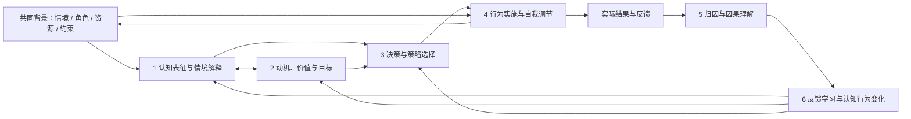

# 认知—行为理解：模块与理论设计

日期：2026-09-06。状态：研究与设计提案，未实现分析模块或修改用户知识。

承接[知识形成、整理写入与检索使用设计](2026-09-06-knowledge-formation-maintenance-retrieval-design.md)，补充[认知—行为图谱](2026-08-20-dimension-cognitive-graph-design.md)的理解方法。现有图谱已经表达“认知 → 决策 → 行动 → 结果 → 认知修订”；本方案定义模型怎样从材料中理解这些对象及关系。

用户最新要求：围绕认知、动机与变化，以及行为方式、选择和归因组织理论模块。先前的归因、个人项目分析、条件性行为模式继续作为适用方法，纳入下面的主结构。

后续取舍见[知识准入、事项生命周期与成本设计](2026-09-06-memory-admission-lifecycle-and-cost.md)：六模块用于按问题选择理解方法；普通事项先保留必要背景与状态，不要求逐事件分析、贴标签或产出长期认识。短期事项仍能作为经历保留，未来需要时重新阅读与解释。

模型用的精简方法已整理为 [cognition-behavior-analysis](../agent-skills/cognition-behavior-analysis/SKILL.md)，有关方法分组按需读取。本文保留面向人的理论设计与验收依据；skill 发现、加载及工具契约见[知识 Agent 设计](2026-09-07-knowledge-agent-contracts-and-skills.md)，尚未接入运行时。

## 1. 总体框架

以社会认知与自我调节为主线。Bandura 的社会认知理论关注人的意图、预期、自我调节和反思，并把人的能动性放在社会结构与环境影响之中。这适合维度同时理解“如何想、为何做、怎样做、怎样从结果中调整”的目标。[Bandura，2001](https://www.annualreviews.org/content/journals/10.1146/annurev.psych.52.1.1)

据此划分六个产品分析模块。这个划分是本方案的设计综合，不是某一心理学理论公认的六个标准模块；它们可以共同解释同一事件，也可以按问题单独使用。

箭头表示需要调查的联系，不自动证明因果；图只显示主要联系。习惯性或被情境触发的行为可以没有显式决策，反馈也可能直接改变后续行为。六个模块不是固定调用顺序，每个事件不必填完六栏。

## 2. 模块对应

| 模块 | 要回答的问题 | 主要理论参照 | 有价值的输出 |
|---|---|---|---|
| 1. 认知表征与情境解释 | 他怎样理解这件事、自己和可行的机会？有哪些信念、假设、预期与判断标准？ | CAPS：认知与情感单元、情境中的条件性反应。[Mischel 与 Shoda，1995](https://pubmed.ncbi.nlm.nih.gov/7740090/) | 有场景和依据的看法、自我判断、条件性认识；区分本人看法与外部事实 |
| 2. 动机、价值与目标 | 为什么这件事值得做？本人认同、兴趣、责任、外界压力如何参与？目标之间是什么关系？ | 自我决定理论（SDT）：动机的自主程度与内化；按需借用个人项目分析。[Ryan 与 Deci，2000](https://selfdeterminationtheory.org/SDT/documents/2000_RyanDeci_SDT.pdf) | 目标与本人理由、在意的价值、并存动机及其情境变化 |
| 3. 决策与策略选择 | 当时考虑过哪些选项，如何看待收益、成功可能性和成本，为何选这种做法？ | 情境化期望—价值理论（SEVT）；有限理性用于检查信息与考虑范围。[Eccles 与 Wigfield，2020](https://www.sciencedirect.com/science/article/pii/S0361476X20300242)、[Simon，1955](https://academic.oup.com/qje/article-abstract/69/1/99/1919737?login=false) | 决策背景、实际考虑的选项、取舍依据、选择策略及待补信息 |
| 4. 行为实施与自我调节 | 选择如何变成行动？怎样开始、推进、应对中断、借助环境与他人？卡在哪里？ | COM-B：能力、机会、动机与行为相互作用。[Michie 等，2011](https://link.springer.com/article/10.1186/1748-5908-6-42) | 有条件的执行方式、启动/维持条件、实际阻碍和协助方向 |
| 5. 归因与因果理解 | 本人如何解释成功、失败和行为？这个解释有什么证据，是否有其他原因？ | Weiner 的归因理论；Kelley 的归因视角用于比较解释。[Weiner，1985](https://www.researchgate.net/publication/19257755_An_Attributional_Theory_of_Achievement_Motivation_and_Emotion) | 本人的归因、系统的竞争解释、支持/反证及可区分它们的材料 |
| 6. 反馈学习与认知行为变化 | 经历之后改变了什么？是做法、目标、判断标准或基本看法，还是条件变化？ | 自我调节学习的循环；双环学习用于区分做法与前提的修订。[Zimmerman，2002](https://doi.org/10.1207/s15430421tip4102_2)、[Argyris，1977](https://store.hbr.org/product/double-loop-learning-in-organizations/77502) | 变化前后、触发信息、变化范围、后续行动及验证情况 |

情境、情绪、社会关系和资源贯穿这些模块。情绪有本人陈述或适当材料时参与解释；不从一句简短指令推断情绪状态，也不要求单列情绪画像。

## 3. 各模块怎样工作

### 3.1 认知表征与情境解释

优先读取本人如何描述问题、如何定义成功、对自身能力和可能结果有什么预期。比较同一事件的事实与本人赋予它的意义，并回看这些看法形成的背景。

例如“我觉得只有把整个方案想清楚才能开始”可以成为一条有来源的信念陈述。它的内容是否符合现实是另一个问题；系统应能记录用户持有某种看法，同时保留支持或挑战该看法的材料。

输出包括信念、假设、框架、条件性判断，以及它们可能影响的决定。对同一人不同情境中的表现，优先形成有适用条件的认识；该模块不预设必须得到稳定人格标签。

### 3.2 动机、价值与目标

区分本人想达到的结果、为什么在意这个结果，以及参与这件事时体验到的自主或压力。动机可以并存，并随项目阶段改变。自主认同也可能是对外部目标的内化；不能简单把“为了结果”判为受控制，把“有收入”判为缺少内在动机。

目标关系通过本人说明和实际选择来检验。个人项目分析帮助把多项活动与本人重视的追求联系起来；活动之间有联系的解释可以先作为假设提出。[Little 的作者说明](https://www.brianrlittle.com/articles/personality-psychology-havings-doings-and-beings-in-context/)

输出保留具体目标、动机来源和范围。比较“想做但认为做不到”“有能力但不值得”“很认同但目前资源不足”等不同情形，而不是统一写为动力不足。

### 3.3 决策与策略选择

回到决策发生时：本人知道什么、真正考虑过哪些选项、看重什么、愿意付出什么，以及怎样决定继续搜索或开始行动。领域中的其他可选方案可以作为后续建议提出，不能补写为用户当时考虑过的选项。

期望—价值视角提供查阅方向：对成功的主观预期、个人重要性、兴趣或用途、付出和放弃其他机会的成本。有限理性视角提醒模型检查当时的信息、时间和考虑范围。这些是阅读与解释维度，不要求从聊天计算效用分数或判定“最优选择”。

将“决定做什么”与“采用什么选择方式”分别记录。例如先用小试验消除关键不确定性，既可能服务某项具体决策，也可能是值得继续观察的策略；一次采用不能直接写成长期偏好。

### 3.4 行为实施与自我调节

把表示意愿、选择方案、开始执行、持续执行和取得结果分开。观察实际启动条件、任务拆分、反馈节奏、被打断后的恢复、工具或他人的作用，以及没有行动时的可见限制。

COM-B 用来检查能力、环境机会和动机如何参与该行为；其动机范围也包括自动过程。这样可以保留主动选择和习惯性反应等不同解释，不强行为每个动作补一段深层理由。

例如计划没有推进时，先查所需资料是否到位、是否真的有时间、任务是否清楚、目标是否还有效。可提出改善某个条件的协助建议，再看后续效果；建议的产生和执行权限分别处理。

### 3.5 归因与因果理解

这里有两个不同对象。

**本人如何解释。** 记录他把结果归因于什么，以及认为该原因是否稳定、可改变或可控制。Weiner 的理论用原因位置、稳定性和可控性组织成就情境中的归因，并讨论其与预期和情绪的联系；在维度中，用这些问题理解某次解释可能怎样影响下一步。

**维度如何检验解释。** 查支持、反例和其他可能原因，区分个人因素、任务条件、环境因素及其共同作用。Kelley 的归因工作提供比较解释的参照。[Kelley，1973 原论文预览](https://www.researchgate.net/publication/235413106_The_processes_of_causal_attribution)

“用户说这次失败是因为能力不够”能证明他这样解释，不能直接证明失败的客观原因。系统也不能默认把责任推向环境；判断随材料更新。若证据允许提出因果假设，说明什么对照或自愿尝试能够区分它与其他解释。

### 3.6 反馈学习与认知行为变化

把事前的判断和预期、行动过程、实际结果、本人对结果的解释以及后续调整连起来。自我调节学习的事前准备、实施和反思循环提供方法参照；双环学习的借用点是进一步追查目标或基本前提是否也改变。

保留变化前后的具体内容与证据。可以只变了做法、收窄了适用条件，也可以推翻旧看法、重排目标或保持原判断。一次成功不等于新规律成立，一次失败也不自动推翻原信念。

“以后准备换一种做法”是意向；后续是否执行以及效果怎样，需要独立结果。模型可以主动发现值得讨论的变化，但不能把自己写出一条新认识当作用户已经成长。

## 4. 两项必须贯穿存取的区分

### 4.1 认知是谁的，结论关于什么

| 内容 | 记录含义 |
|---|---|
| 用户说“我相信 X” | 本人表达的看法；X 的真实性另有证据状态 |
| 维度推测“用户可能相信 X” | 系统对用户认知的假设，保留依据与待确认范围 |
| 维度判断“用户在条件 C 下倾向采用 Y” | 系统对行为模式的认识，不能冒充用户自述 |
| 材料表明“行动 A 后观察到结果 B” | 已知事件关系；A 导致 B 的机制或独立效果仍可能不确定 |

每项认识需要能表达持有者/被描述对象、陈述内容与本次判断来源。复用 scope、authority 和证据角色，必要的补充字段在领域契约中统一定义；不能仅靠句子里写“我觉得”区分。

### 4.2 “变化”至少分清以下几种情况

| 情况 | 应怎样处理 | 什么不能据此声称 |
|---|---|---|
| 用户的看法、价值排序或目标真实改变 | 保留前后内容、有效时间、触发信息与本人说明，继续查看行为影响 | 新说法已经被长期实践验证 |
| 用户采用了新的行动策略 | 记录行动条件与做法变化，查是否也改变了判断 | 换了一次做法就改了基本信念 |
| 环境或任务条件改变 | 更新条件，并重新评估依赖它的解释 | 表现变化必然是人格变化 |
| 维度纠正了原先的误解 | 修订系统认识，说明原判断为什么不成立 | 用户因此改变了自己 |
| 新材料补足了此前观察范围 | 补证据、调整支持程度或保留争议 | 材料被发现的时间就是用户变化的时间 |

这组区别与既有双时态、版本修订共同工作。背景事实和系统画像更新触发知识治理；人的认知或行为改变则需要相应的个人材料。二者的数量和结果不能混算。

## 5. 接入材料理解与知识治理

六个模块是统一知识服务的分析能力。运行时先理解当前材料与问题，再选有关模块及方法；方法可以组合，证据足够时也可以直接记录事实。

记录、解释、沉淀和本次使用分别判断。比如讨论下周是否旅游，先读相关约束与体验；真正需要理解取舍才用决策模块，收到事后反馈才可能进一步用变化模块。一次事件可以保留完整背景而暂不形成心理解释；一次分析也可以只服务当下回答。模块之间共用同一事项与依据，不生成六套同义记录，也不固定分成六次调用。

“按需使用”不等于只写事件摘要。本人已经讲出的本次动机、预期和选择依据，应在本轮形成必要的结构化对象及关系；其范围可以只是一件短期事项。比如恢复精力的目标、认为出游能够缓解疲劳的收益预期、担心交付时间更紧的成本预期，都能连接同一旅游决策。完整的节点、关系与依据示例见[准入设计第 3.4 节](2026-09-06-memory-admission-lifecycle-and-cost.md)。

一次工作可从“某个选择始终解释不清”“行动没有取得预期结果”“旧看法遇到反例”或新的本人说明开始。按相关主体、项目、时间及理解问题查背景，再比较解释。模块的实际贡献应体现为：补读了哪段有用背景、增加了什么关系、修正了哪项认识、找到了什么有区分力的下一步。

| 理解产物 | 与现有图谱设计的衔接 |
|---|---|
| 信念、看法、价值、偏好及暂定认识 | claim / observation；区分本人认知与系统对用户的判断 |
| 动机、目标与项目关联 | 关联已有目标、项目和相关 claim；需要理由和范围，不以理论标签代替内容 |
| 取舍及选择方式 | decision 的问题、实际选项、选择与理由；用 influences 连接有依据的影响关系 |
| 实际行为与尝试 | action / experiment；与决策、触发条件和可用资源关联 |
| 结果、归因与竞争解释 | outcome 加相应 claim / observation；supports / contradicts 记录判断依据，必要时用 tension 组织分歧 |
| 看法或策略的变化 | updates / supersedes 和内容版本；注明是实际变化还是系统纠错，并保留背景依赖 |

这里是领域语义映射，不宣称每项字段已在运行时实现。分析模块名称用于选方法和查看覆盖，存储仍优先使用既有对象，不按六模块复制六份个人画像。

简短依据要保留：关键背景、本人解释、系统解释及限制。方法引用作为分析过程的参考，与关于用户的证据分开。既有 Toulmin 结构用于表达论证，AGM 等规则用于管理修订；它们与解释认知行为的心理学方法承担不同职责。

## 6. 示例：理解一次做法与看法的调整

以下是假设测试材料，不是新增用户事实：

> 以前我总想把整个方案定完再给人试。上次把最不确定的一点先做出来给两个人试，才发现问题和预想不同。我现在觉得应该先验证最不确定的部分，其他先留着。

模型应找回所指方案、试用前预期与实际反馈。可形成的认识包括：原先的启动条件、新采用的试验策略、本人报告的预期差异，以及现在提出的条件性新判断。两个人的具体反馈与结果若未找到，就保持来源缺口；“总想”也先保留为本人概括的范围。

动机模块只有在相关材料能补充理由时才展开；没有必要为这段材料强行推断自主需要。归因模块区分“用户将改观归于这次试验”与“试验已经证明该策略在所有任务中更优”。变化模块保留本人报告的看法调整，并等待下一次实际采用的结果。

下次讨论类似项目时，检索可以带出这条判断及适用条件，帮助用户对照是否值得继续先验证关键不确定性。若任务条件不同，模型应重新判断，而不是机械套用“先做 Demo”。

## 7. 理论使用与验收

这组理论提供观察与推理的参照。SEVT 和自我调节学习的重要研究背景是教育与成就活动；双环学习来自组织学习；借用到维度的其他生活场景要说明适用范围，并以真实材料回放验证。任何来源都不能直接验证本产品自动理解某个人的准确性。

首批验收应覆盖：

- 同一行为、不同动机与条件，能否保留不同解释。
- 认同目标但缺少机会或能力，能否找到实际阻碍。
- 决策选项未被记录，能否保留缺口而不补造个人经历。
- 本人归因缺乏客观支持，能否同时保存自述与竞争解释。
- 做法变化、看法变化、环境变化和系统纠错，能否正确区分。
- 只有普通事实时，能否直接处理；需要背景时，能否主动查回。
- 新认识进入下一轮建议后，是否仍带着适用条件，并能接收实际结果。

沿用治理设计中的对照回放：比较背景补查前后、方法加入前后的理解质量和成本。评价单位是具体认识及其使用结果，不以调用了几个模块、术语多少或修订条数代替效果。
