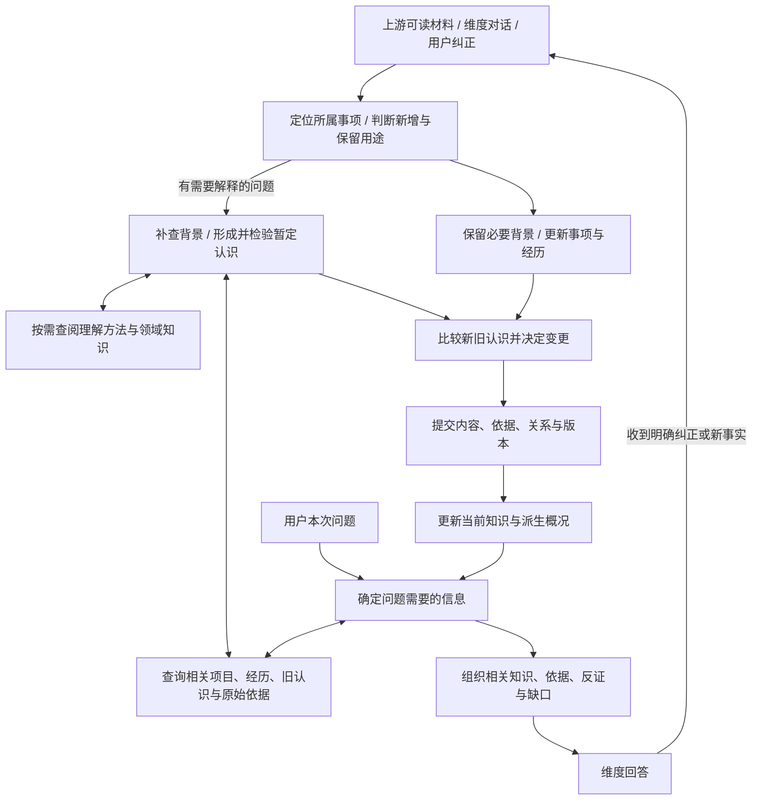

# 知识形成、整理写入与检索使用设计

状态：设计提案，未执行数据迁移、代码实现或定时启用。2026-09-06。

本文细化[知识库治理方案](../plans/2026-09-05-knowledge-governance.md)，主要回答三个问题：从材料中理解什么、怎样把理解整理进知识库、回答时怎样找到并正确使用它们。底座修复、运行节奏和验收一并定义。

本次修订：第一环节以“主动补查背景、形成并检验理解”为核心。按认知—行为主线设置六项分析能力，详见[认知—行为理解模块](2026-09-06-cognition-behavior-understanding-modules.md)：认知解释、动机目标、决策选择、行为调节、归因理解、反馈与变化。心理学方法按解释问题选用，其效果通过回放检验。

进一步细化：[知识准入、事项生命周期与成本设计](2026-09-06-memory-admission-lifecycle-and-cost.md) 分开定义保留、分析和使用。当前事项与过去经历都可以有价值，不必先成为长期画像；按事项变化整理，按问题深入理解，再选择性维护可复用认识。相关运行节奏以本次细化为准。

2026-09-07 补充：[知识 Agent 契约与 Skills](2026-09-07-knowledge-agent-contracts-and-skills.md) 将精确契约、简短模型说明与人用设计分开，定义独立治理 Agent 及治理、检索调查、认知—行为分析三份产品 skill 草案，尚未接入运行时。

本文不包含实际个人数据或对话原文，涉及个人行为的例子均为虚构验收场景。设计时检查接口代码，发现已经新增 `excludeHistory`、活动摘要整理、`history_memories` 和本地可读记忆文件；这些是代码事实，本轮未验收其线上效果。

## 1. 核心设计

**一个知识服务负责三条相互连接的流程。模型判断内容和意义，程序保证来源、版本、状态和提交结果一致。**

这些是职责划分，不要求部署三个 Agent，也不要求每轮固定经过若干次模型调用。后台形成与维护在独立的持久任务中运行；在线回答使用同一套查询与修订能力。

最终用户体验是：维度平时逐渐积累理解；被问到时能找到相关背景和理由；用户指出误解后，相关认识与后续回答一起改变。

### 与现有 Computer History 工作的分工

上游负责采集、正文读取、屏幕事件处理、对话/活动材料、原始来源访问和到期限制。本模块负责组织事项与经历、跨材料形成可复用认识、维护关系与版本、组织回答所需知识。

9 月 6 日代码已有一条来源内的记忆路径：`HistoryService` 挑选已有摘要的活动，调用 `history_read`、`history_memory`、`history_save_memory`，写入 `history_memories`；本地 `memories.json` 是它的可编辑投影。现有活动记忆任务的提示词还明确禁止把相同内容另存入图谱。

因此，接入本方案不能直接再启动第二个任务，把同样的活动认识复制到 nodes。设计采用以下承接方式：

1. 接入期用统一读接口同时读取既有图谱与活动记忆，返回稳定的类型化身份、版本和来源。每条认识仍只有一个写入归属，修改路由回其原有存储。
2. 跨来源治理可以比较两边的认识，用正式引用连接；生成综合理解时引用各自根源，不能将同一份材料当成两份独立支持。
3. 目标是统一长期知识的版本化维护。实施时迁移或映射已有活动记忆，保留原 ID 映射、用户修改、来源组、删除语义和文件入口；完成读写兼容与回读后再切换写入者。
4. 活动摘要继续由上游维护；来源内记忆提炼纳入本治理服务的输入/写入适配，避免两套后台任务分别决定同一认识的内容。现有采集、摘要和原文访问边界继续有效。

本次只定义衔接目标，不改另一项工作的采集、预处理或现有运行设置。

## 2. 流程一：补全背景并形成理解

本环节的工作单位是一件值得理解的事，可以是一段交互、一次选择、一个项目的阶段变化，或跨材料反复出现的问题。目标是解释这件事与用户处境、目标和其他经历的关系，并形成能改善后续帮助的认识。摘录和摘要是其中的基础能力。

先判断本次需要保留到哪一步。普通进展可以只更新事项；有意义的选择可以保留背景、理由与结果；遇到重要疑点、矛盾或可复用线索才深入解释。一次事项有多轮消息时组织成同一工作项，不逐条重复走完整理解流程。

### 2.1 输入不是一堆没有上下文的句子

本模块消费上游已有材料接口，并取得以下信息；缺失项如实标明，不在这里另写屏幕重建器。

| 输入信息 | 用途 |
|---|---|
| 材料身份、版本、到达顺序 | 判断是否读过、旧材料有没有被补全，避免漏掉迟到导入 |
| 可读内容与上下文位置 | 理解前后对话、选择条件和结果，需要时继续回读 |
| 来源、作者/说话者、所讨论的对象 | 区分用户说自己、用户描述他人、AI 给建议、产品设计要求 |
| 发生时间、记录时间及其可靠程度 | 不把今天看到旧消息当成今天发生，也不把抓取时间当发送时间 |
| 覆盖缺口、原文可用性、到期与使用范围 | 说明能支持到哪一步，决定需要补读还是保留待补 |

对话材料需要保留“问了什么—如何回答—用户怎样选择或纠正”的关系。来源没有提供这些内容时，不从标题或最终成稿反推出用户的思考过程。

### 2.2 主动补查会改变解释的背景

背景检索发生在形成解释时，不能等候选已经定型后才查旧知识去重。每次先判断：现在缺哪段背景，补到后可能使理解发生实质变化。根据这个问题选择读取范围。

| 背景层次 | 要理解什么 | 优先从哪里补 |
|---|---|---|
| 当前事件与交互 | 前面发生了什么、本人如何理解这件事、为什么在这个时刻作出反应、后来怎样 | 当前对话前后文、真实工具输出与任务结果、本人后续说明 |
| 相关项目与个人处境 | 正在推进什么、处于哪一阶段、这件事与以往选择或纠正有什么联系 | 已有目标/项目、有关经历、决策记录、明确自述及其来源 |
| 选择空间与约束 | 当时还有什么可行选择、有哪些责任/成本/期限、哪些条件并不由本人决定 | 任务要求、承诺与现实条件；本人对考虑或放弃选项的说明 |
| 对照情境与变化 | 类似条件下是否也这样、条件改变时如何变化、出现过哪些反例 | 其他独立事件、其他关系或任务场景、同一项目的前后阶段 |
| 必要的领域背景 | 某种行为是否有普通的任务解释，理解所用概念是否准确 | 项目文档、可靠外部资料和适用的方法说明 |

例如看到用户要求 Agent 出示完成证据，先查它之前声称做了什么、实际交付了什么、用户在做真实交付还是产品测试。若工具确实没有完成，纠正行为首先有这一具体背景；再讨论稳定偏好时，需要另外的支持。表中的问题是阅读方向，不要求每条材料填完所有格子。

补查先沿当前事件和相关对象展开，按缺口扩展到其他授权来源。本人已经讲过的背景应主动找回；确实只有本人能说明、又足以改变重要判断的问题，才在合适的对话中请本人补充。后台保留待补事项，避免每条材料都打断用户。

把补到的背景区分为可核对事实、已有推测和仍未知项，带上来源与适用时间。一般心理学或职业常识只能产生可能解释；个人经历、情绪、动机和当时可选方案需要个人材料支持。允许模型提出新的合理假设，并标明缺少什么区分证据。

原有画像也可能有误，因此从相关事件、目标和本人解释开始阅读，再与旧判断比较；不能只围绕一个已知人格标签寻找吻合材料。没有某种活动记录时，先看来源是否覆盖该情境。

### 2.3 带着理解问题阅读，并形成新认识

一轮可以从新材料、旧知识的疑点、未解释的选择或已有待补问题开始。模型根据内容提出值得追查的问题，例如“这批反复提问在解决什么问题”“几项看似分散的活动是否服务同一目标”“为什么同一个人在两种情境下采用不同做法”。

处理过程是一个可往返的循环：

**发现值得理解的事情 → 补查相关背景 → 形成暂定解释 → 找能区分解释的材料 → 修订并决定保留什么。**

新解释可以连接原本分散的事实，发现目标之间的支持或牵制、同一行为的多种用途、用户自己尚未概括的条件性模式。它要说明新增理解在哪里，以及下次讨论、建议或协助时有什么实际用途。仅把“反复追问”换成“求知欲强”，没有增加解释依据。

比较解释时，读能使判断发生变化的材料。例如“遇到错误工具才严格验收”和“在多种自选任务中都主动设计验收”需要不同的对照；再读十次同一种报错未必能区分两者。能够并存的原因就保留并存，不为了选出唯一动机而强行排除。

处理深度由问题的重要性、解释分歧、来源可得性和继续阅读的预期收益决定。关键缺口已经解决，或当前没有更多有效来源时结束；未解决项记录下一步需要的材料及重看时机。

材料选择可以灵活，处理记录必须说明哪些材料确实检查过，不能把未读内容标成无价值。

模型围绕后续用途判断：这是否补充了用户的重要背景，解释了一个选择，明确了一个目标/限制，改变了对某件事的理解，或提供了值得继续验证的行为线索。近期任务所需的临时事实也可以保留，并标适用时间；长期知识不只意味着终身人格特征。

高频有助于判断是否反复出现；少见但主动、有选择空间、付出明显成本的行为也可能更有区分力。重要性使用可读理由，不规定一个统一加权分或“出现三次就算偏好”的阈值。

允许以下处理结果；同一事项可同时获得状态更新与新的理解，不复制为多份独立证据：

- 保留事实与经历：记录有后续用途的当前事项或事件背景，不必提出心理解释。事项结束后可以作为历史被查回。
- 值得提出认识：形成有新增量和复用价值的候选，交给新旧知识比较。
- 暂时不足：保留必要线索，记录缺什么、关联什么问题；有材料补充时重看。
- 不新增语义记录：没有新增个人信息、事项连续性或值得整理的经历时，只记本批输入已检查；原会话按来源规则保留。

“没有长期人格信息”不能作为抛弃一次重要选择及其理由的依据；“将来可能分析人格”也不足以为每个普通动作建节点。保留方式、准入例子和旅游的完整生命周期见[专项设计第 3–5 节](2026-09-06-memory-admission-lifecycle-and-cost.md)。

### 2.4 心理学方法作为按需使用的理解工具

方法库围绕[认知—行为理解模块](2026-09-06-cognition-behavior-understanding-modules.md)组织，整体以社会认知与自我调节为主线。六项能力分别处理本人怎样理解、为什么在意、怎样选择、如何行动、怎样解释结果，以及经历后改变了什么。它们共同使用情境背景，不能成为每条材料的固定流水线。

归因、个人项目分析和条件性行为模式是其中的具体方法。下表保留其用途，完整模块、其他理论参照和图谱映射见上述设计。只有某种方法能帮助提出更好的问题、找到有区分力的材料或解释现有差异时才使用；明确事实或普通项目进展可以直接处理。

| 适用问题 | 可借用的方法 | 在本设计中的具体用法 |
|---|---|---|
| 这主要是个人倾向，还是当时情境的作用？ | 归因视角：比较个人与情境解释。[Kelley 的原论文预览](https://www.researchgate.net/publication/235413106_The_processes_of_causal_attribution) | 检查任务压力、对象行为和其他普通解释，再找类似/不同条件下的实际对照；得到有适用条件的归因假设 |
| 为什么同一个人在不同场景中表现不同？ | CAPS 的条件性行为模式：关注随情境而变化的 if–then 关系。[Mischel 与 Shoda，1995](https://pubmed.ncbi.nlm.nih.gov/7740090/) | 连同本人对情境的理解、目标和反应来比较；证据允许时描述“在某类条件下通常怎样”，再检查例外及预测范围 |
| 多项活动对本人有什么意义，彼此是什么关系？ | 个人项目分析：围绕本人重视的追求，联系行动、上层目标与情境。[Little 的作者说明](https://www.brianrlittle.com/articles/personality-psychology-havings-doings-and-beings-in-context/) | 找回本人为什么推进这些事、看重什么、遇到哪些支持或困难；提出项目之间的共同目标或牵制关系，并用本人说明与实际选择校验 |

这里采用的是对理论视角的工程化借用。上表定义的模型工作方式是本方案设计，论文并不证明聊天记录自动分析的有效性。本人没有提供的内心体验继续作为未知；理论也不成为某项个人判断的新证据。

方法以简短、可维护的说明供模型按需查阅，包含：解决什么问题、何时适用、需要观察什么、容易误用在哪里、原始参考与版本。复用现有外部资料与 method 类型，明确其知识归属；不把整套心理学教材常驻每轮上下文。可按需要补充其他可靠方法，简单方法已经能解释时及时收束。

模型用的简明入口已另写为 [cognition-behavior-analysis](../agent-skills/cognition-behavior-analysis/SKILL.md)，复杂读取方法见 [knowledge-investigation](../agent-skills/knowledge-investigation/SKILL.md)。运行时需提供可发现的目录与资源读取能力；当前文件存在不等于已经自动加载。完整设计与验收表面向人，不作为默认模型上下文。

采用方法时，在本轮判断说明中留下它实际帮助检索或比较了什么；没有实际贡献就省略。给用户呈现具体发现和可核对依据，术语只在解释方法或讨论理论时出现。MBTI 等类型框架按用户具体问题选用，不作为每次理解材料的默认入口。

### 2.5 同一材料可以支持不同深度的认识

| 深度 | 例子 | 写入要求 |
|---|---|---|
| 可核对的陈述/事件 | 假设用户说明，这批重复设置提醒是为了测试通知 | 记录本人说了什么及适用的这批交互；不扩展成所有未来交互 |
| 具体行为观察 | 同一天几次主动设置同一个活动的提醒 | 保留各次真实事件与场景；区别一次内容被多次采集 |
| 对行为的解释 | 这些设置可能同时承担实际提醒和通知测试 | 说明哪些部分来自本人解释、哪些是模型推断，允许其他动机并存 |
| 跨场景模式 | 用户在多个独立情境中偏好某种探索或决策方式 | 回看其他情境、反例和普通替代解释；证据不足就维持较窄认识 |

这四种深度不是强制晋级流程。可以只留下一个具体事实，不继续上升到稳定人格；也可以在多份充分材料之间提出新的综合理解。

对人格问题，模型可借助适当的领域知识解释，但领域知识不是用户证据。如果缺乏某框架的准确知识，按任务补读可靠资料，再明确哪些是框架定义、哪些是关于用户的推测。本设计不预设任何人格类型为处理目标。

### 2.6 输出一份小而可核查的候选

候选可以是事项变化、带背景的经历或可复用认识。保留可核对的叙述及时间、对象和阶段来源，同时结构化已经可知的目标、当次动机、认知预期与取舍。需要独立使用和纠正的命题有独立身份，不必等成为长期特质才入图；同一项目中有关联的命题可以组成一组。下列字段是按候选类型使用的表达契约，不要求把每句话或名词都拆成节点，也不要求每个事件填满心理分析表。

一次输出可以同时包含节点、关系、来源及简短背景。本人说出的认知与系统推测的认知分别标记；认知已被表达与其内容符合现实也分别标记。旅游的动机、收益预期、成本预期与决策如何组成子图，见[准入设计第 3.4 节](2026-09-06-memory-admission-lifecycle-and-cost.md)。

| 候选字段 | 内容 |
|---|---|
| 主体与场景 | 关于谁/哪个项目，在什么任务或关系下成立 |
| 认识陈述与建议类型 | 具体说什么，适合 observation、goal、project、claim 等哪一类 |
| 关键背景与依赖 | 哪些项目、经历、目标或约束使这项解释成立；引用其身份和版本，不复制整份画像 |
| 证据使用 | 精确来源身份和版本；其作用是直接陈述、支持、反证、纠正还是上下文 |
| 依据与新增理解 | 材料如何支持认识，比原有记录多理解了什么；简短说明，不保存隐藏推理链 |
| 边界与待补 | 对动机、特质等推测说明替代解释与缺口；简单事实可省略不必要字段 |
| 时间与关系线索 | 已知适用时间、可能关联的旧节点、目标或选择 |
| 后续用途 | 若适用，这项认识会怎样改善讨论、建议或协助；建议本身不自动成为用户偏好或行动授权 |

候选首先是本轮工作对象，不默认都入长期库，也不要求逐条弹窗确认。明确值得保留、证据适当的推测沿用可撤销自动写入授权。

关键背景成为认识的正式依赖，发生纠正时进入第 3.4 节的复查流程；一轮探索中没有保留价值的问题不必全部建节点。

涉及认知和变化时，还要标明认识的持有者/被描述对象：本人表达的信念与系统推测的信念分别记录。变化要区分本人看法变化、行动策略变化、环境变化、系统纠错与观察范围补足；模型更新了知识不等于用户改变了认知。对应规则见理解模块第 4 节。

**本环节的完成标准：重要背景确实被补读，提出的认识增加了可核对的关系、解释或可用背景；未知有去向。记录事实也有价值，不要求每次产生洞察。**

## 3. 流程二：整理并写入

### 3.1 先找已有认识，再决定是否写

用主体、项目、主题、时间、别名与候选陈述召回相关知识，同时读其当前版本、来源和适用条件。比如“维度”“Latitude”“你这个秘书 Agent”可能指同一个项目，但要根据这段对话判断，不能固定将“你”映射为项目。

相似检索只提供待比较对象，不直接决定合并。判断核心是：是不是在说同一个对象、同一个命题、同一时间和条件；新材料增加了什么。

### 3.2 写入决定及其含义

| 决定 | 什么时候用 | 实际改变 |
|---|---|---|
| 新增 | 现有库没有这项有价值的认识 | 创建节点并关联依据、有关对象 |
| 补充 | 同一认识获得新的独立依据、具体细节或理由 | 保留知识身份，增加正式证据/关系与版本 |
| 合并 | 多条实为同一命题，合并不会丢失场景差异 | 选定保留项或创建合并版本；旧 ID 可解析，历史和来源不丢失 |
| 拆分 | 一条包含能分别对错的多个判断 | 创建独立项及组合/来源关系，原组合仍可回看 |
| 收窄 | 新材料表明只有特定情境成立 | 修改适用范围与陈述，保留范围变化记录 |
| 替代 | 旧解释有误，或用户现实状态改变 | 新版本替代旧版本；区分理解纠错和现实变化 |
| 并存争议 | 两个解释都仍有依据 | 保留各自依据、冲突与不确定性，必要时提出共创问题 |
| 撤回/待复查 | 依据失效、用户否定、过时且影响当前使用 | 停止把它作为当前结论，保留适当历史或执行用户的忘记请求 |
| 不变/待补 | 没有新信息，或尚不足以作出改变 | 记录处理结果，不制造新节点或改写已有认识 |

在上述虚构提醒场景中，后续补充的实际提醒需求增加了一个并存原因，不应合并成“只是在测试”。“工作时要求验收”和“探索时保留选项”属于不同场景，不必当成相互推翻。

事实、用户自述与模型推断在写入时继续分开。模型摘要引用了用户原话，不代表整段解释都获得用户确认；用户确认/纠正要绑定具体目标、原话和范围，不能仅凭证据的作者是 user 就提高整项权威。

### 3.3 把相关修改作为一个完整变更提交

每次提交包含：所读对象及版本、拟改变内容、增删的正式证据关联、关系变更、简短理由、需要重新检查的依赖、稳定请求身份。

程序执行以下一致性检查：

1. 知识和证据身份真实，来源版本仍可用，本次允许使用这些来源。
2. 被修改节点仍是模型读过的版本；若用户刚改过，返回版本冲突并重新读取。
3. 节点内容、证据关联、关系和版本在同一事务中提交；失败全部不生效。
4. 同一请求重试回到同一结果；成功返回实际受影响身份与变更记录。

模型的语义判断不能由这些结构检查证明正确。涉及解释变化的操作仍要经过内容验证，不能因为字段齐全就当成有依据。

通用 `knowledge_update` 当前没有正式证据关联、scope 和完整版本修订能力，需要扩展领域命令。claim 的专用版本化路径继续使用，不允许通过普通字段修改绕过。合并/拆分的多个节点也必须在一个可恢复的变更内协调，不能让模型连续调用几次普通写入后猜测整体成功。

### 3.4 修改之后，检查哪些认识受影响

依赖包括原始证据关联、使解释成立的关键背景、派生关系、组合画像、当前概况及索引。关系先统一方向：supports 为“依据 → 判断”，derived_from 为“派生项 → 来源”，supersedes 为“新版 → 旧版”；EvidenceRef-only 来源通过正式关联处理，不为每个原始事件重建图节点。

修改直接目标后，标记相关项需要检查。后台按需重新评估，不能盲目推翻整片知识：一个来源失效，其他独立依据可能仍然成立。受影响项未完成复查时，回答侧可使用直接有效的新事实，并看到其他判断尚待核实，不能继续无标记使用旧摘要。

“忘记这项认识”同时影响再提取规则，避免旧材料下一轮又把它建回来；这和暂时停放候选、事实自然过时是不同操作。保留的抑制记录遵守用户删除范围，不保存被要求删除的原文。

**本环节的完成标准：正文、正式依据、关系与版本一致；用户纠正不会被后台旧版本覆盖；重复运行不不断增加近义节点。**

## 4. 流程三：回答时提取和使用知识

### 4.1 把自动提供的背景与按问题检索分开

对话开始时提供一份有版本的简洁导航：重要近期变化、与当前情境有关的背景、需持续尊重的明确偏好/限制、可继续查阅的主题。它由当前知识派生，不复制整个周回顾，也不把所有工作元数据混入正文。

用户提出具体问题后，模型再确定需要哪些信息。问题不同，阅读范围就不同：

| 问题 | 优先需要什么 | 不宜直接用什么代替 |
|---|---|---|
| “我最近在忙什么” | 时间范围内的项目、活动、进展与未明结果 | 一份长期人格标签清单 |
| “我下周要不要旅游” | 当前真实约束、有关偏好与既往体验，以及本次尚未决定的选项 | 自动把提问写成确定行程，或先重算完整人格 |
| “你对我这个人有什么理解” | 跨情境的选择、动机说明、偏好、反例及覆盖限制 | 事件目录或单一工作场景 |
| “我为什么同时考虑这几条路” | 选择背景、目标关系、本人理由、约束和变化 | 仅按选项名称拼出的解释 |
| “为什么你上次猜错” | 当时可用材料、当时版本与后续纠正 | 用后来知道的答案反推当时应当知道 |

这些是设计示例，不是写死的意图分类路由。模型可以调整查询、追加阅读，也可以在材料足够时直接回答。

### 4.2 检索流程

**定位问题涉及的对象和主题 → 多种方式召回 → 读取相关关系与来源 → 比较相关性、时效、证据独立性 → 组织回答材料。**

上述流程可往返，不是只沿游标前进。每次先明确会改变答案的缺口，再依据结果选择继续分页、换词或对象、调整时间范围、转查经历、沿关系展开、回源、核对反例或停止。下一步应有望增加有用依据；重复命中同一来源不能作为进展。完整方法和停止判断见 [knowledge-investigation](../agent-skills/knowledge-investigation/SKILL.md)。

首版在既有 SQLite 上补齐对象/主题导航、别名与关键词查询，并结合图关系扩展。模型可以用同义表达改写查询，寻找旧表述。检索索引可重建，不能存成第二份权威知识；语义索引是否加入由真实跨表达召回评测决定，不用检索相似度当证据强度。

召回先统一落实本次来源、主体及当前/历史范围，再由模型选择相关材料。排序考虑问题相关性、情境匹配、明确纠正、新旧版本与证据质量；最近更新时间只用于辅助，不能把“刚被后台重写”当成“最近新发生”。

读到某条判断时，应能同时查看支持、反证、纠正、替代解释和原文可用性。关系跨页时明确仍有未读内容，由模型判断继续同路、转查关键依据或结束。反证与纠正分别说明已发现、所示范围查过未见或未检查，不能合并成一个布尔值。某方向没有找到材料时，返回搜索过的范围与缺口，而不是自动当成没有反证。

材料不足时，继续读授权范围内的活动原文、完整会话或文件；只有摘要可用就以摘要的证据强度回答。来源已到期、明确排除或不可访问时保留限制，不绕过上游读取边界。

查询可以直接找事件，不要求它事先已被解释为某种偏好。时间、对象、主题和背景描述帮助定位；心理标签不能代替内容阅读。将同一事项的多个片段、摘要及派生认识带入回答时保留共同根源，避免重复占用上下文或增加证据权重。

### 4.3 返回一份问题相关的上下文

这是供回答使用的视图，不新建“已确认事实表”。

| 内容 | 作用 |
|---|---|
| 相关当前知识及版本 | 让回答知道实际使用的是哪项认识 |
| 原文引用/可回源位置 | 核查关键陈述是否超出了来源 |
| 支持、反证、纠正及共同根源 | 避免只选支持信息和重复计算同一材料 |
| 主体、场景、有效时间与权威标记 | 避免把项目要求变成整个人格，或把旧状态当现在 |
| 已读取范围、剩余分页与缺口 | 指导是否需要继续检索，避免把初始页当全库 |
| 派生关系与待复查状态 | 确保旧摘要不会覆盖新的直接纠正 |

回答前，模型检查主要结论是否受这些材料支持，判断强度是否与来源覆盖相称。这是回答质量判断，不必机械增加一个独立模型审查步骤。某些维度未知时，未知要影响候选范围和结论强度，不能只在文字里加一句不确定。

### 4.4 当前态、历史态和诊断态用同一套定义

- 当前回答：已撤回、被替代、失效或停放的候选不当作当前事实。暂定解释可以使用，但带上其暂定性质；争议项与反证一起出现。
- 过去经历仍可服务当前问题：已结束的旅行可以帮助本次建议，但必须以过去经历使用；退出当前事项窗口不等于删除或否定历史。预计日期已过但缺结果时，不推断事情已经发生。
- 历史问题：按当时记录版本及适用时间回放，并区分后来补录和后来纠正，不能泄露未来信息。
- 治理诊断：可以查看演示、历史和来源未知记录，但来源标记保留，不能由诊断读取自动获得个人事实资格。

`getPersonalContext`、`knowledge_context`、`compile_context` 与活动记忆查询应落实这套共同语义。当前已经出现的 `excludeHistory` 和受管理历史工具继续沿用；还需验证关系扩展、摘要、旧会话上下文、索引及文件投影是否传递相同限制。本轮只确认参数和处理路径存在，不宣称全链路已验证。

**本环节的完成标准：新开一轮真实会话，确实使用正确版本与相应依据；找不到的信息保持缺失，不由旧画像补成事实。**

## 5. 用同一案例串起三个环节

以下是虚构的活动提醒工具测试场景，用于说明预期处理，不是实际用户记录或已经执行的知识变更。

| 输入 | 提炼 | 整理写入 | 下一次回答如何变化 |
|---|---|---|---|
| 假设用户同一天反复设置同一个活动的提醒 | 保留具体重复行为；动机尚不充分 | 与已有相关交互比较，不每次新建一个人格标签 | 可以描述重复设置，暂不能确定是测试、实际提醒需要还是其他原因 |
| 用户说明这批设置用于检查通知能否正常送达 | 获得本人说明的本次动机 | 补正式纠正引用，修订对应解释，标记相关画像需要复查 | 解释这批设置时，使用这一范围明确的说明 |
| 用户随后补充，活动临近，也确实需要提醒 | 测试与实际使用目的同时存在 | 为对应行为补第二个原因，不推翻测试成分 | 回答同时考虑测试目的与实际提醒需求 |
| 用户说明正在组织一场社区活动 | 获得项目目标与交互背景 | 关联项目、阶段要求和上述设置行为 | 能解释通知测试如何服务活动准备，而不只复述操作次数 |
| 后续询问自己是否一贯喜欢提前准备 | 需要跨情境选择、动机和反例 | 本次普通提问本身不必再写一条长期观察 | 根据现有覆盖给有限判断；不从单次活动推断稳定特质，也不借后续自述伪装成盲推断 |

第二类验收使用不同情境的虚构材料：活动执行阶段要求明确验收，筹备探索阶段倾向保留可能性。系统应先判断是否可并存及适用范围，再考虑是否支持更广泛的特质，不按某一种行为直接分类。

### 补背景后应多理解什么

对于上述重复设置提醒的场景，模型先找回活动目标、该批通知表现及本人两次动机说明，再判断这些操作承担的用途。测试材料支持“这批操作兼有通知测试与实际提醒需求”这一范围明确的认识。项目背景是否足以进一步解释测试目标，仍要看实际读到的材料。

由此提出的协助建议可以是：下次遇到同类反馈，同时核对通知送达情况与临近事项的提醒需求。此建议是从材料得到的使用方向，不能自动写成用户已经要求以后每次都这样处理。如果另外提出“重复测试也是为了降低活动失误风险”，应另标假设，并说明还需什么材料支持。

个人项目方法在这里帮助追问交互服务什么目标；归因视角帮助比较具体工具表现与个人倾向；仅在积累了不同情境的对照时，条件性模式视角才可能有进一步价值。它们无需同时出场。

## 6. 长期任务与运行记录

### 节奏

周期检查与模型工作分开。每小时检查增量、每日检查综合维护候选可作为调度起点；没有新材料、依赖变化或到期待办时，不启动模型。综合维护只围绕有理由重看的旧认识、背景缺口和未解释关联展开，不每日重读全库。明确纠正、来源变化与忘记请求立即更新有关状态。周期尚未启用，模型读取和思考轮数不写死。

现有活动记忆任务已经有自己的轮询与节流，统一接入时应迁移它的处理职责和进度，不同时再跑一个读取同批材料的独立写入者。上游摘要任务保持独立。

一轮处理可选择优先事项，但需要持续照顾积压材料、少见经历和观察覆盖缺口，不能只处理最新二十条或高频事项。来源即将到期时由任务调度提示，模型判断是否保留有后续用途的简短经历；也可决定不新增记录或材料不足，不能复制原文绕过到期。

在线与后台共用输入版本、事项身份、提交回执和工作进度；在线已经处理的变化，后台不从头再做。同一事项的普通补充可以合批，重要决定与纠正及时处理。深层解释按缺口选模块，已有分析仅在依赖仍有效时复用。

费用按实际计费调用记录，覆盖整理、维护、检索辅助、回答及各环节失败重试，另列索引与工具成本。用户配置后台预算时，未完成分析保留进度；必要的纠正、忘记和失效标记不等待模型预算。未配置时不添加隐藏限额。模型分工、成本口径及验证方式见[专项设计第 7–8 节](2026-09-06-memory-admission-lifecycle-and-cost.md)。

### 每次留下什么

运行记录包含：本轮要理解的问题、补查了哪些背景及输入版本、读到哪里、提出了什么改变、哪些决定是不变、实际变更回执是什么，还有哪些事项需补材料或重试。使用方法时记录参考版本和实际用途；记录简短判断依据，保留材料到假设再到修订的可核查路径。原始全文及逐字派生副本继续遵守上游保留期限，不把调试日志变成永久原文库。

工作项状态区分待处理、处理中、待补、可重试失败和已处理；已处理再说明发生变更、不变或按范围排除。进程崩溃后根据真实提交回执恢复，睡眠错过的周期合并补处理。

自己的摘要和推测不会被当作新用户经历再次提炼。依赖变化才触发相应维护，防止反复自我引用、置信度不断上升。用户预算暂停只暂停模型整理，保留处理状态，不假装完成。

### 用户看到什么

独立入口可以查看“目前对你的理解”“最近改变”“依据与待补”。重点显示“修正了什么理解、为什么”，数量和任务日志放在详情里。

每项支持纠正、补充、停放或忘记；能够看旧版本和来源。普通整理安静运行，不每小时发一篇总结。重要新判断、关键矛盾或需要用户补充的信息，才形成可忽略的共创提示。

## 7. 需要补充的底层契约

保留图谱主体，补以下机制。下列接口名是拟议职责名称，不是已经存在的工具。

| 拟议能力 | 输入/输出的关键内容 | 现有能力如何接入 |
|---|---|---|
| 材料待办读取 `material_changes` | 来源身份与版本、到达游标、待处理范围；支持分页和迟到修订 | 对接上游活动组/摘要及已有消息证据，不重做采集 |
| 背景与旧知识查询 `knowledge_lookup` | 理解问题、主体/项目/主题/陈述、当前或历史范围；返回相关经历、目标、背景与可比较版本，个人材料和方法资料明确区分 | 形成解释前和整理写入前共用；复用 context/evidence/图遍历，适配 history_memories 与外部方法资料 |
| 一致性变更 `knowledge_apply` | 预期版本、变更动作、正式证据/关系、依赖及稳定请求 ID | 复用 Change Set、claim 专用修订与回滚；扩展补证据、scope、合并拆分 |
| 当前知识视图 `knowledge_view` | 本次问题与来源范围；返回相关知识、版本、依据、冲突和缺口 | 接入 getPersonalContext 和回答工具，不再只拼最新节点 |
| 治理完成记录 `governance_settle` | 已处理输入版本、不变/待补理由、对应提交回执 | 与提交事务或可恢复的幂等回执关联，不靠模型一句话推进游标 |

数据层的最小改动包括：

- 内容版本与读取版本校验；来源、节点及活动记忆身份的映射。
- 正式证据关联的增补/移除与角色修改，payload 中的引用改为派生输出。
- 关键背景依赖、可追踪的待理解问题及方法参考身份；复用既有节点和任务记录，避免再建一份画像。
- 统一关系定义及历史方向修复；依赖失效和待复查记录。
- 治理工作项、处理回执及索引/概况版本；运行状态复用现有任务体系。
- 跨来源的读取范围与当前/历史状态定义；沿用既有来源开关、到期和删除边界。
- 跨会话事项身份、阶段来源与生命周期；先映射既有 decision / action / outcome 等对象，避免为每个动作增加节点。
- 按来源与知识版本恢复的增量进度、分析缓存失效，以及各计费阶段和失败重试的成本记录。

首次整理针对已有真实坏例子运行：隔离演示派生内容、补缺失纠正关系、处理 scope 为空的真实认识、校正关系方向、处理重复资源，随后再补充尚未整理的材料。

## 8. 验收与故障定位

| 环节 | 重点检查 | 不通过时归因到哪里 |
|---|---|---|
| 材料进入 | 原文/摘要是否可读、作者和上下文是否足够、读取范围是否如实记录 | 上游材料缺口或读取覆盖；不能靠延长回答修复 |
| 背景补查 | 相关旧背景是否实际找到；能否发现会改变解释的缺口；有没有被旧标签带偏 | 问题形成、背景召回与阅读选择 |
| 理解形成 | 有没有解释行为与处境/目标的关系、发现可核对的新关联；是否把 AI 的话归给用户或越出场景 | 假设比较、内容知识与方法适用性，回看背景和候选 |
| 整理决定 | 应并存却合并、应收窄却推翻、重复内容被多次加强 | 新旧比较和关系语义 |
| 提交 | 新证据在正文里却不在正式关联；重试重复写；覆盖用户新改动 | 版本与事务契约 |
| 检索 | 库中有且有效，但没找到或被旧摘要挤出 | 召回、过滤、关系扩展与上下文组织 |
| 回答 | 已读到纠正仍误用、未知维度没有约束判断 | 证据解释与结论校准 |

测试材料覆盖：多轮纠正顺序、不同场景并存、同一根源重复摘要、少见重要决定、已停放候选、来源到期/删除、并发纠正、提交后中断、迟到材料、旧文件编辑冲突。补充同一表面行为但背景不同的对照材料、多条活动共享目标的材料，以及没有必要使用心理学的普通事实。再用未参与提示词修改的合成对话或经授权且脱敏的材料检查迁移能力。

认知—行为模块还需验收：本人归因与系统因果判断的区分，意向/选择/实际行动的区分，以及真实认知变化、策略变化和系统误解修正的区分。方法选用是否恰当，要看其带来的具体理解及后续帮助。

新增旅游生命周期回放：跨轮继续讨论、改期/取消、日期已过而结果未知、事后反馈、未来类似建议及人格提问。对比逐条提取、全面模块分析和按需理解，分别报告背景保留、错误泛化、后续帮助与全链路成本；不把少存知识本身当作优化成果。

先在隔离测试库中生成并检查具体变更，随后做真实模型与下一轮对话回放。历史测试使用当时可用的材料；记住已知自述与在未知结果条件下形成推断分开评价，保留的测试标签不得进入盲推断输入。

采用这几类结果判断质量：重要信息是否覆盖、陈述是否被来源支持、错误归因是否减少、用户纠正是否持续生效、无新材料是否保持稳定、回答是否使用最新有效认识。每个结果可回到具体例子，不要求模型给自己报一个“理解准确率”。

针对本次修订，使用相同材料范围、模型和相近预算，对照“直接提炼”“加入主动背景补查”“补查并按需使用心理学方法”。分别检查关键背景召回、解释区分能力、新关联的证据支持、后续回答帮助与额外开销；方法没有贡献或增加过度解释，就调整或停用。表述更长、术语更多、用户表示像自己，均不能单独证明理解改善。

实施按依赖推进：先统一身份/范围/关系/版本，再完成提炼与写入，再接通回答视图和持续运行，最后用整条用户旅程验收。最终交付应包含三条流程、历史兼容和用户纠正入口，不能把其中任一环节作为未定义的后续优化。
