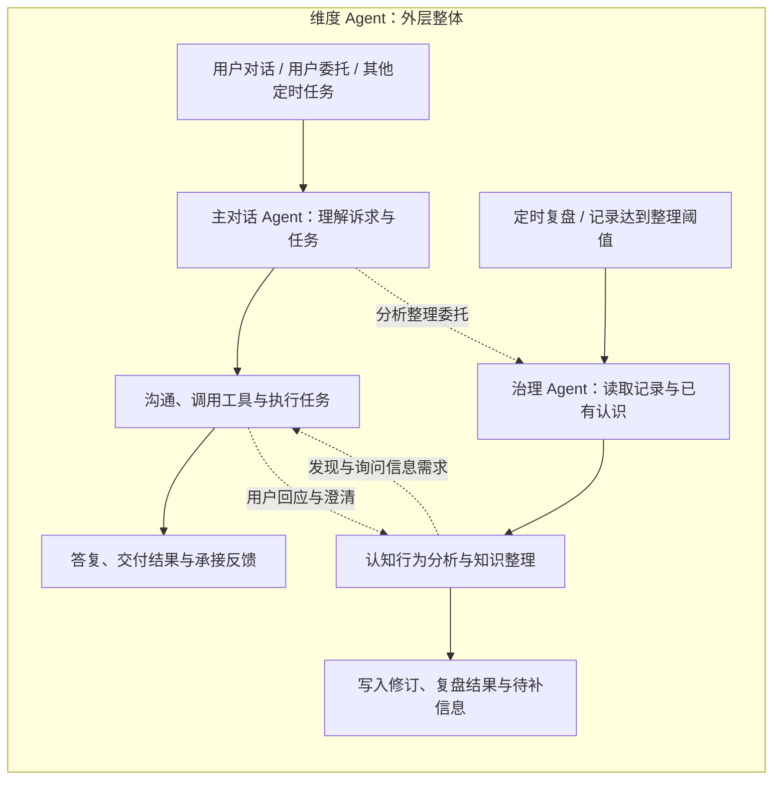
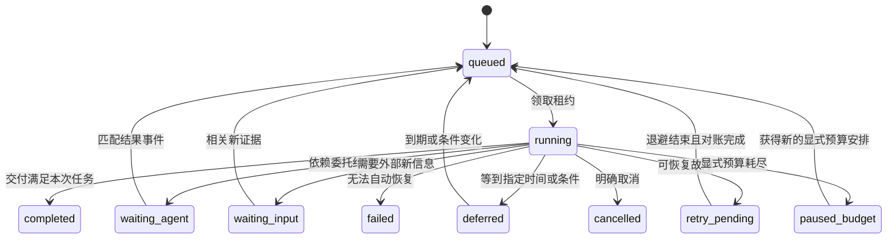

# 主对话 Agent 与知识治理 Agent：内部 Runtime 设计

状态：2026-09-08，可供实现拆分的设计稿，未修改执行代码、启动 Agent 或启用定时任务。承接[双 Agent 协作方案](2026-09-07-main-and-governance-agents.md)的职责划分。本文中的新增类型、工具和模块均为拟议接口。

## 1. 总体决策

2026-09-08 最新实施原则：少放硬性护栏和防御性编程，平衡模型放权与必要边界，优先依照 DSH 已有能力开发。本文的 WorkStore、新 SQLite、租约及消息工具是实现候选，不是逐项必建清单；已有框架能承担的直接复用，确有缺口再补。删掉的微观规则不搬成代码限制。完整任务交接见[handoff](../plans/2026-09-08-latitude-agent-handoff.md)。

**维度 Agent 是外层整体，内部是并列的两条直链**：主对话 Agent 承接用户对话、用户委托与其他定时任务；治理 Agent 承接定时复盘与记录达到阈值后的整理。两条直链中间按需要横向交互，各自保存和恢复进度。外层统一提供角色装配、执行、调度、工具、上下文及任务状态能力。

两种角色拥有独立会话、上下文装配、工具集合和交付契约，共享模型接入、知识与证据服务、权限校验、审计和资源调度。外层的共用能力是共享执行实现，不意味着所有任务进入同一个模型会话或全局串行队列。分析能力允许重叠，知识治理与沟通协助的最终责任分别归属两条链。

**维度 Agent 内核是上述外层整体的运行实现，基于 DSH 二次开发**，统一负责模型—工具自主循环、角色装配、上下文与技能加载、执行边界及运行恢复。DSH 是技术基础，循环、压缩、扩展点和状态接口可按维度需求修改，不限定为仅在外部包装。现有 Latitude Host 承担的运行装配与恢复能力逐步纳入内核设计；Domain 保持领域数据和事务职责。认知分析步骤不编译成固定工作流。下文仅在描述现有依赖行为和代码位置时保留 DSH 原名，二开能力仍以本文的待实施状态为准。



## 2. 现有底座与需要补齐的部分

以下是本轮读取工作区代码的结果，不代表此前版本或运行中的服务已经同步。

| 现有位置 | 已有能力 | 本次需要补齐 |
|---|---|---|
| `services/agent/src/runtime/dshRuntime.ts`：`bootInternal` | 单一 Context、模型适配、AgentLoop、TokenMeter、工具剪枝、压缩、请求重试 | 保留底座；按角色装配执行能力 |
| 同文件：`createHandle` | 按 sessionId 缓存 handle；统一人设、行为与上下文；注册 Domain、桌面等工具 | 引入角色配置和能力清单；缓存身份包含配置及来源权限版本 |
| 同文件：`executeTurn` | 保存用户消息证据、初始化个人上下文、执行 followup/whenIdle、审计及可选表达整理 | 类型化任务入口与结果；治理任务不走普通回答表达整理 |
| `services/agent/src/types.ts` | `initiator` 区分 user/scheduler，结果以 assistantText 为中心 | 区分角色、模式、事件来源、逻辑任务与执行尝试 |
| `services/agent/src/jobs/jobStore.ts` | 运行持久快照、幂等键、取消；重启把 queued/running 标记为 host_restarted 失败 | 任务等待、领取租约、恢复与写入对账 |
| `services/agent/src/scheduler/durableScheduler.ts` | 到期扫描、事件唤醒、持久调度回执及重试 | 调度到角色任务；依据任务交付状态判断完成 |
| `services/agent/src/persistence/auditLedger.ts` | 文件追加日志、会话代际、事件回放 | 保留审计职责；不把多个文件写入视为一个事务 |

当前 `executeTurn` 对非 scheduler 请求走用户消息入证路径，因此新增 Agent 间请求不能仅把分析文本塞进普通 text 入口。否则会把 AI 判断污染为用户自述。当前部分工具限制依赖 session 名称及 initiator，也不能直接当作双角色权限系统。

## 3. 先区分四个对象

| 对象 | 含义 | 生命周期 |
|---|---|---|
| RoleProfile | 角色能做什么、如何装配、交付什么 | 有版本的运行配置 |
| WorkItem | 某条链承担的一项工作，如旅行建议或该事项的知识修订 | 可跨多次运行及用户回应；有唯一负责角色 |
| RunAttempt | 本次模型执行 | 开始到完成、暂停、取消或故障 |
| Session | 维度 Agent 内核管理的对话事件与压缩表层 | 可被恢复；不是知识库或任务状态本身 |

一次治理运行正常结束，可以留下 `WorkItem.waiting_input`。一次运行故障，也不意味着整件事永远失败。业务状态不能从“模型停止输出”推断。

同一真实事项可关联多个 WorkItem：主的建议工作已完成，治理的预期修订仍等待结果，两者并不冲突。已有事项身份由 Domain 负责；WorkStore 不用一个共享 running/completed 字段代表两条链，也不为双链再建两份旅游事项。尚未定位事项时允许只关联证据与当前对话，不强行造节点。

### 3.1 不可变输入与可变进度

Host 在可信入口构造执行信封；模型文本和浏览器字段不能提升角色权限。

```ts
type Role = 'main' | 'governance';
type Mode = 'conversation' | 'task_execution' | 'proactive_dialogue' | 'knowledge_governance';

interface ExecutionEnvelope {
  workId: string;
  attemptId: string;
  role: Role;
  matterRefs: string[]; // 已定位的共享事项；允许为空
  dependencyRefs: string[]; // 只有实际阻塞本次工作的依赖才列入
  mode: Mode; // Host 校验 role/mode 的合法组合
  origin: 'user' | 'scheduler' | 'agent_request' | 'source_event';
  causeId: string;
  replyTo?: string;
  sessionId: string;
  profileVersion: string;
  sourceAccessRevision: string;
  inputRefs: Array<{ id: string; version: string }>;
  expectedResult: 'conversation_reply' | 'task_result' | 'dialogue_disposition' | 'governance_result';
  budgets?: AgentRunBudgets; // 继承调用方显式预算，不注入默认低上限
}
```

可变状态单独保存：当前任务版本、已读范围与缺口、关联事项、操作回执、待接收事件、会话代际、取消状态和累计用量。不能通过改写原始信封隐藏任务中途的目标或来源变化。

每条链分别记录已消费事件水位。共享事件可供两条链使用，但一方确认接收不能代替另一方确认。仅在 dependencyRefs 指明的必要结果未就绪时进入等待；同一事项的另一链正在运行，不构成默认阻塞。

恢复时保留 workId，创建新 attemptId。输入有增量就形成新的任务版本；旧运行的最终提交必须检查这个版本。

## 4. 两个 Agent 的内部装配

| 装配项 | 主对话 Agent | 治理 Agent |
|---|---|---|
| 系统说明 | 秘书身份、沟通目标、知识与证据关系、真实回执 | 用户认知行为理解、知识维护目标、范围与证据关系、真实回执 |
| 当次输入 | 用户话语、委托目标、到期任务配置，或治理的信息需求 | 本事项新材料、旧认识、纠正、依赖变化或明确委托 |
| 初始上下文 | 便宜的个人导航、当前会话近期交流；主动模式再加已有询问状态 | 事项导航、上次处理水位、变化摘要、相关知识身份与状态 |
| 工作记忆 | 当前问题、答复进度、已知缺口、委托及交互状态 | 增量候选、证据范围、解释差异、待提交变更及待补信息 |
| 按需 skills | 检索调查、主动复盘沟通、其他秘书能力 | 知识治理；按需检索调查及认知—行为分析 |
| 主要输出 | 回答、业务回执，或开展/合并/延后/不开展交互及卡片回执 | 已提交变化、不变、待补、分析结果、信息需求及真实回执 |
| 停止依据 | 回答或任务交付成立；需等待依赖或后续事件；明确中断 | 本次增量处理有结论；继续需要外部输入；明确中断 |

### 4.1 主对话 Agent 运行

主链运行模式包括普通对话、任务执行和主动沟通。`task_execution` 既可由用户委托触发，也可由定时任务触发；加载任务目标、既有授权、时间范围、上次进度、交付位置与所需工具，返回 `task_result`，不能把后台任务都压成一次询问卡片。定时简报、安排检查等由主链执行。

角色与触发来源分别记录：`origin=scheduler` 可以配合主链的任务执行，也可以配合治理链的知识整理。调度路由依据持久任务的职责与配置，不依据“是否定时”一刀切。

普通对话优先载入当前用户消息与近期交流，以导航确定需要补充的知识。主动沟通载入治理交付的语义信息需求，以及最近对话、已有卡片、用户沟通偏好；不伪造用户发起的消息，也不默认把完整治理日志交给主对话 Agent。

主对话 Agent 可以直接分析当前问题；发现需要跨材料维护知识时，通过委托工具提交治理任务。当前回答必须依赖结果时，保存续接点并释放运行资源，结果到达后恢复；能够先回答时正常回应，委托异步完成。

主动沟通模式的最终交付是 `dialogue_disposition`：开展交互、并入现有交互、延后或不开展。开展交互时由主对话 Agent 写用户可见内容，提交前工具核验需求版本及已有回答；治理不提供需要机械转发的最终问句。

现有可选 `responsePresenter` 仅保留给普通回答，并服从现有开关。治理结果不经过它；卡片内容由主对话 Agent 直接生成并经结构校验，不能用第二次自由改写损坏卡片身份、选项语义或引用。

### 4.2 治理 Agent 运行

常规启动来自定时复盘或记录达到整理阈值；横向委托和用户回应可触发或恢复有关工作。启动单元为一件事项或一个明确治理问题。先提供增量与相关旧认识的导航，让模型自主决定补什么背景、找什么反例、调用哪些方法。定时全局复盘先做导航级扫描，产生或合并事项工作，不在一次运行里强行重分析整个人生。

治理的基础关注是来源归属、事项关联、相对已知的增量、自述理由与预期、纠正及反例、时间与适用范围。当前情境中的明确动机和认知预期可以立即形成有范围的图谱关系；“默认浅层”不能把它们删成纯事件摘要。跨情境模式和更深归因按需要展开。

例如假设材料明确说“想出去缓解疲劳，但担心影响交付”，可以形成本次选择关联的恢复目标、预期收益、交付约束和预期代价；不能直接上升为稳定逃避模式。这里只是测试材料，不是用户实际旅行计划。

治理可先提交有依据的部分，再交付待补的信息需求。生成分析不自动等于入库：`分析候选 → 与现有知识比较 → 提交必要变更 → 返回提交回执`。不变、范围收窄和保留未知都是正常结果。

## 5. 上下文与 Skills 加载

采用五部分装配：稳定角色说明、可信任务信封、短导航、当次材料与工作状态、按需方法资源。稳定前缀尽量不变；新材料和动态字段放后部。导航大小是可调读取默认值，不是认识用户的硬边界。

技能目录初始只给名称、用途和资源身份。拟新增 `skill_read(name, resource?)` 返回版本与正文；入口技能较短，长方法放 references，由模型自主选择。已有四份 repo 内 skill 是资源草案，目前没有完成该加载器接入。

治理任务把 `knowledge-governance` 作为角色的基础工作说明；`cognition-behavior-analysis` 按需读。主对话 Agent 的主动沟通模式可装配简短的 `proactive-review-dialogue` 入口。不要每个模型步骤重复注入同一技能，也不要把完整六模块分析表放进基础提示词。

技能记录版本和本次使用身份；方法升级只在新尝试或明确重装配时应用。方法文本不能授权写入或扩大来源范围。两角色共享技能目录，实际可执行动作仍由工具契约决定。

检索循环为“明确当前缺口 → 选择取证动作 → 读取 → 判断信息增量及下一步”。可分页、改写查询、调整时间或对象、沿关系读取、回源、找反证或停止。不是固定地反复 next page。`not_checked`、`none_found`、`found` 区分反证未查、在已查范围未找到、已找到；空结果不能代表不存在。

查询记录保留 queryIdentity、已搜范围、游标适用查询版本、来源水位和缺口，避免压缩后重复搜索。连续无增量时先提示重复及可调整方向；由模型改查、带缺口结束或请求补充，不用固定三次搜索强行判定失败。

## 6. 工具与执行边界

| 工具组 | 主对话 Agent | 治理 Agent |
|---|---|---|
| 当前知识、历史版本、证据读取 | 按来源授权读 | 按来源授权读；诊断范围由可信任务授权 |
| skill_read、任务状态及回执查询 | 可用 | 可用 |
| 用户原话、回应证据保存 | 可信消息入口负责；不让模型伪造作者 | 读取引用；不能将自身解释标为用户原话 |
| 日程、行动、桌面协助、人设设置 | 按既有授权及相应业务接口使用 | 不装配与治理无关的操作 |
| 知识形成、合并、修订、依赖维护 | 提交治理候选；兼容路径带原回执 | 使用版本化知识变更接口 |
| 明确纠正 | 保存原话、优先采用、标记已定位旧认识待复查 | 解析影响范围、修订及重新评估依赖 |
| Agent 委托 | 提交分析与治理需求 | 提交发现与沟通信息需求 |
| 询问卡片创建、改写、交互安排 | 可用 | 通过主对话 Agent 承接 |

工具注册时按 RoleProfile 裁剪；执行时再检查可信角色、当前任务、版本和来源范围。不能只在 prompt 写“请勿调用”，也不能只靠 sessionId 前缀区分权限。此处是职责实现，不追加用户已授权的普通写入审批。

每个工具调用必须关联 attemptId 和能力上下文。以后开放维度 Agent 内核的通用子 Agent 能力时须继承或收窄该上下文；未经注册归属的执行者不能因查不到 ActiveRun 就跳过执行校验。首版不需要开放通用任意子 Agent 创建工具，双角色调用走明确任务接口。

缓存 handle 的身份至少包含 sessionId、角色、配置版本、模型配置版本和来源权限版本。发生改变时失效旧 handle，并决定以新代际重建合规上下文。权限检查覆盖初始化、检索、旧摘要、归档读取、恢复点与工具执行，不能只过滤新查询。

## 7. 共享执行循环与持久状态

Host 的固定生命周期如下；其中“模型—工具”可以自主多次循环，不规定心理学推理顺序。

1. 持久接受任务，幂等去重，领取执行租约。
2. 验证角色与来源范围，装配或恢复 Session、上下文和技能目录。
3. 运行维度 Agent 内核的模型—工具循环；工具提交产生可查询回执，进度事件持续可见。
4. 检查类型化交付、任务版本及真实操作结果。
5. 原子保存任务状态、恢复点与待投递事件，结束本次运行并释放资源。



等待状态不保留正在运行的模型，不占并发槽。取消不自动重试；重试恢复的是工作进度，不是再执行整段工具历史。完成项出现新证据，创建关联的后续工作或显式新修订，不悄悄复活旧完成版本。

### 7.1 WorkStore 与数据归属

建议新增 Host 侧事务型 `WorkStore`（本地 SQLite），存 WorkItem、RunAttempt、Inbox、Outbox、Checkpoint、交叉投递记录和操作意图。它记录两条链各自的进度以及哪里发生了关联，不负责将双链编排成固定流水线。它是编排状态的唯一权威；现有 AuditLedger 继续存执行审计及会话事件。

知识、证据、业务日程与用户可见询问记录由 Domain 管理。信息需求与询问卡片的语义状态也归 Domain；WorkStore 只引用其身份和版本，不在第二处维护另一份“已解决”结论。UI 通过产品读模型展示卡片，不能以组件是否挂载代表交互状态。

两个存储间不假装存在跨库事务：Domain 在自身事务中提交业务变更、幂等回执和 change outbox；Host 按唯一 eventId 接收，原子写 Inbox 与对应任务，投递后确认。反向投递同理。允许至少一次发送，通过幂等消费实现一次业务效果。

执行租约使用递增 fencing token 防止旧 worker 提交任务终态；Domain 写入仍须校验自己的 expectedVersion 与 operationId。任务租约不能代替知识版本冲突检测。卡片发布还需检查信息需求版本及其是否已经解决。

## 8. 两角色消息协议和交付结果

### 8.1 三种交叉通道

| 通道 | 运行语义 | 例子 |
|---|---|---|
| 共享读取 | 不主动启动另一链；当前运行按需读取最新有效知识 | 主对话 Agent 下次给建议时读到治理修订的恢复预期 |
| 变化投递 | 将增量交给关联工作合并或重新评估，不默认等待回复 | 同一行动结果分别交给主的跟进工作与治理的分析工作 |
| 明确委托 | 创建有关联身份的工作与交付要求；只有必要依赖才等待 | 主请求核实跨事件模式；治理请求主组织沟通 |

程序依据事项身份、登记依赖和事件版本确定候选接收工作；模型判断变化是否影响分析或帮助方式。语义关联尚不清楚的材料进入增量聚合，不按关键词立即双向广播。共享读取不必创建请求回执。

交叉记录至少包含 eventId、causeId、源 workId、接收 workId/角色、事项引用、输入版本、通道类型和消费状态。单一来源证据只保存一次；分发两次不构成两份独立支持证据。已消费同一版本不重复唤醒；新的事实、纠正或有实质影响的知识版本仍可触发。

为防止自激循环，普通运行完成、投递确认和没有语义增量的通知不生成新的治理材料。治理更新仅唤醒登记了相关依赖的工作，或生成有明确价值的信息需求；不把每次知识提交广播成一次主对话 Agent 询问。模型接收的事件附变化摘要及已有消费记录，判断是否继续、合并或不变。

### 8.2 委托与结果

拟新增 `governance_submit`、`dialogue_request`、`work_read`、`work_yield`、`work_complete` 等 Host 工具。提交返回持久接受回执；不以一次工具调用阻塞等待另一个 Agent 完整运行。

统一消息信封带 eventId、requestId、causeId、replyTo、workId、输入引用与版本。返回结果关联原请求；原始用户回应作为新证据事件，主对话 Agent 的解读另带作者身份。AI 分析或普通完成通知不能再次被当作新用户材料。

| 交付 | 必备内容 | 验证方式 |
|---|---|---|
| conversation_reply | 回答、引用、委托及业务回执身份 | 不要求每次聊天产生知识变更；所称成功必须有对应回执 |
| task_result | 委托或定时任务身份、完成范围、产物、操作回执及未完成项 | 根据原任务交付要求核验；已生成、已保存、已送达分别记录 |
| dialogue_disposition | 信息需求身份与版本、开展/合并/延后/不开展、实际卡片或安排回执 | 发布前核验需求有效；延后带可恢复时间或事件条件 |
| governance_result | 处理范围与水位、分析摘要、变更回执、不变/待补说明、信息需求引用 | 写入回执真实且版本匹配；未提交候选不能报已更新 |

结构校验失败给模型返回具体缺字段或冲突，允许修复。没有合法交付时只记录本次未完成，不用最后一段自然语言猜测提交成功。结构正确不证明分析正确，后者由证据与验收评估。

某次交叉形成主→治理→主的依赖环时：治理先返回有用的部分结果与信息需求，让主解除 waiting_agent，再处理沟通。治理本工作可进入 waiting_input。禁止让治理为拿到用户答案再等待一个尚在等自己的主任务。这只是必要委托的异常协调规则，不是双链默认执行路径。

去重针对同一事项、同一信息缺口及输入版本；新增用户证据仍可再次唤醒。信息需求不变的通知不新建询问；需求变化则更新同一身份并使旧卡片失效。关联匹配有歧义时保留待判断，不能仅凭旅游等关键词自动认定用户已经答复。

## 9. 压缩、恢复与错误处理

### 9.1 压缩不承担任务记账

本地安装的 DSH rc.6 已提供压力触发的工具结果剪枝、摘要压缩和溢出恢复。包内说明明确：工具剪枝按文本头尾保留，不理解中间信息的语义；摘要调用是直接 llm.stream，不经过仅限 Agent 循环的 agent/request 钩子。因此不能假定当前运行钩子自然覆盖压缩的所有配置与成本。

维度 Agent 内核以现有压缩实现为起点，按双链需求扩展；关键恢复信息独立保存：任务目标与版本、输入来源及时间水位、已提交 operationId/receiptId、待解决信息需求、已查范围与缺口、下一步需要的外部事件。保存可核验工作状态和简短理由，不持久化隐藏思维链。

对关键证据保留引用、作者、适用范围、反证检查状态和有效期。压缩后通过当前版本任务投影重新注入这些小字段，需要原文再回源。来源已删除或到期时按真实可用性处理，不能用旧工具日志还原已被撤回的数据。具体保存期限沿用来源服务规则，本方案不调整 Computer History 实现。

### 9.2 恢复顺序

重启扫描未结任务 → 接管过期租约 → 对账未决操作 → 校验输入/知识/来源权限版本 → 重建合规会话与任务摘要 → 创建新 attempt。不能直接把旧 prompt 再跑一遍当作恢复。

| 中断位置 | 恢复方式 |
|---|---|
| 模型读取中失败 | 从已有安全恢复点继续；未产生有效结果不推进材料水位 |
| Domain 已提交，Host 未收到回复 | 用同一 operationId 查回执；已有提交直接采用，无回执时由幂等接口安全重试 |
| Agent 请求已接受，发送方断线 | 按 requestId 查任务，重复投递不创建第二份 |
| 卡片创建后 UI 未确认收到 | 重放同一卡片版本，展示确认只更新投递状态 |
| 用户回应已保存，治理未接收 | Domain outbox 重投；先保存原话再确认接收，避免回复丢失 |
| 运行中出现新纠正 | 当前回答采用新证据；旧知识写入因版本冲突退回重读 |
| 来源授权变更 | 中止或重装配受影响运行，旧摘要及缓存不得继续绕过边界 |
| 用户取消 | 停止后续执行；已发生副作用对账保留，不把取消解释为自动撤销 |

只在成功提交、确认不变或明确记录待补后推进该事项的处理水位；待补依赖另行登记，不能因水位前进而永不复查。外部工具没有幂等或结果查询能力时，把结果未知单列，不能自动重放有副作用操作。

## 10. 并发、成本与调度

保留现有调用方显式预算语义，不设默认“最多几步/几页”作为推理终止规则。模型收到读取增量与重复信号，判断何时足够。部署的并发容量、API 速率与队列背压作为资源设置，区别于限制模型理解深度。

用户当前对话优先进入队列；明确纠正优先于普通周期治理。后台任务按事项合并新材料，同时用等待时长避免长期饥饿。主对话 Agent 等待治理时立即释放执行槽，即使并发容量为一也不能死锁。同一会话输出串行，同一事项变更靠版本合并，不把所有知识读取串行化。

定时器先按任务职责分派：用户委托和其他定时任务进入主链，定时复盘和达到整理阈值的记录进入治理链。主链任务到期即按其配置执行，不能因没有知识增量而跳过；治理检查未处理增量、到期复盘及变更依赖。没有到期工作或达到条件的增量不调用模型；多份同源派生材料合并计算。复盘频率和增量聚合阈值作为产品配置，日志反馈后调优，不在本文臆定最佳分钟数。

成本账本以 workId 聚合所有 attempts：主循环、重试、压缩、可选表达整理、两个角色调用以及工具费用。主对话 Agent 发起委托不把治理实际花费重复记账；分别记归因与真实调用。用模型返回 usage 计量，缺失标 unavailable，不能当作零。

显式整体预算需覆盖子任务分配与非主循环模型调用，不能每次续跑重置成新额度。耗尽进入 paused_budget，保存进度，不标成功或自动无限续费。故障重试与推理长度分开：鉴权/配置错误、明确取消不靠重跑解决；暂时错误使用退避。现有 Scheduler 的三次尝试不能直接照搬为两个 Agent 的完整恢复语义。

## 11. 实施拆分

模块路径为建议；优先在现有 Host 上提取，避免一次性重写 runtime。

| 拟议模块/现有改动点 | 责任 | 首个验收结果 |
|---|---|---|
| `runtime/roleProfiles.ts` + `createHandle` | 角色配置、工具集合、缓存版本 | 两角色工具与上下文确实不同，普通聊天不退化 |
| `types.ts` + 可信 HTTP/调度入口 | 执行信封、类型化交付 | Agent 请求不产生 user-authored 证据 |
| `runtime/contextAssembler.ts`、`skillLoader.ts` | 导航、恢复状态、按需技能 | 实际模型输入包含正确角色、来源与已加载技能版本 |
| `jobs/workStore.ts`、`workDispatcher.ts` | 任务、租约、收发件箱、恢复点 | 一次委托在重试和重启下只有一个逻辑任务 |
| Domain 变更接口与 outbox | 幂等提交、知识/需求/卡片版本与回执 | 提交后断线不会重复写入或重复建卡 |
| `runtime/workTools.ts`、`resultValidator.ts` | 交付、等待与恢复 | 待用户补充不误记为任务完成 |
| `durableScheduler.ts` | 定时/增量派发、恢复与优先级 | 普通定时任务进入主链；治理按到期或阈值触发；取消不重试 |
| 交互读模型与现有卡片入口 | 展示、回应、版本更新 | 无活跃聊天也能问；回应能回到原事项 |
| 用量与 trace 投影 | 跨角色因果链、成本与故障边界 | 能追踪从材料到写入/交互的第一处偏差 |

落地顺序：角色装配与类型边界 → 主委托治理的真实写入闭环 → 持久请求及等待恢复 → 治理委托主的卡片闭环 → 周期与增量治理 → 故障、成本和长期运行验收。保持旧在线入口兼容，切换时携带旧提交回执，不双写同一认识。

## 12. 验收设计与本轮验证边界

先测确定性协议，再跑真实模型行为。协议测试通过不能代替模型能否正确分析和沟通。

| 验收层 | 核心场景 |
|---|---|
| 装配与归属 | AI 委托不会存为用户原话；治理拿不到桌面动作；权限变更后旧上下文不能继续读 |
| 状态与故障注入 | 提交成功后断线、两次重复投递、领取后重启、旧租约提交、版本冲突、取消后的晚到结果 |
| 完整交互 | 无聊天定时复盘→信息需求→主生成卡片→部分回应→治理修订；用户普通聊天回答也能关联 |
| 定时路由 | 主链执行定时简报，即使无知识增量；治理仅在复盘到期、整理阈值达到或交叉续接时启动 |
| 双链独立推进 | 主可在治理未完成时继续建议；治理可在无主委托时处理增量；一条链完成或取消不自动结束另一条 |
| 交叉与收敛 | 同一结果分别消费而不重复计为证据；普通知识更新不自动询问；无增量回执不循环唤醒；新纠正仍能触发 |
| 模型检索 | 第一页只有支持材料，反例在另一来源；空查询后能换方向；查不到时保留未知 |
| 知识理解 | 情境动机保留；职业约束不推为稳定人格；单次旅游不形成泛化性格标签；纠正优先更新 |
| UI 状态 | 收起不等于拒绝，投递成功不等于回答，晚到回应不覆写已解决的新版本 |
| 成本与续跑 | 无到期工作且无达到条件的增量时零模型调用；压缩/表达整理/委托计入成本；显式预算跨恢复不重置 |

Trace 展示输入引用与作者、角色配置版本、实际模型请求装配摘要、检索范围及缺口、工具及回执、公开决策理由、等待与恢复原因。它用于诊断数据是否到达、判断是否有依据、提交是否真实，不要求暴露隐藏思维链。

本轮已核对上述本地 runtime、JobStore、Scheduler、AuditLedger 和安装依赖说明。复用 runtime-execution-orchestrator 的阶段与状态分析方法；其校验脚本针对另一个项目的 `query.ts` 布局，在本仓库报告源文件缺失，不能作为 Latitude 验收通过。本轮改用实际源码入口及文档引用检查；尚未验证双角色运行、压缩保留质量、崩溃恢复或真实用户交互。
