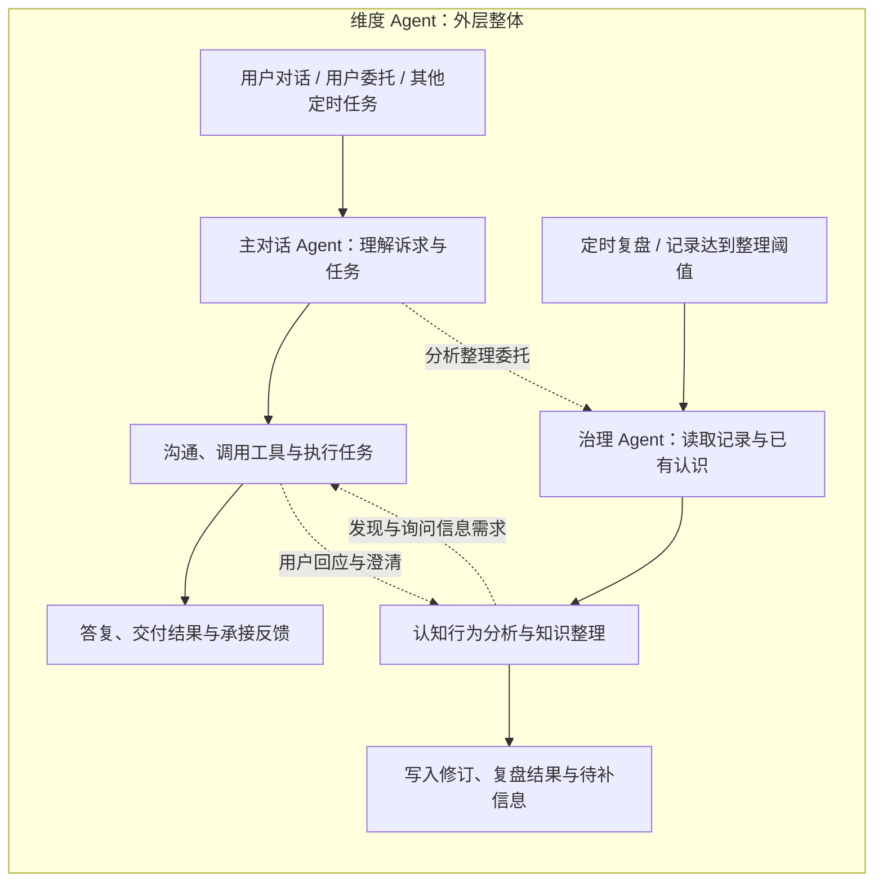

# 主对话 Agent 与知识治理 Agent 协作方案

状态：2026-09-08 设计方案与 skill 草案。未接入运行时、未创建独立服务或启用定时任务。本文承接[知识 Agent 契约与 Skills](2026-09-07-knowledge-agent-contracts-and-skills.md)，以本轮明确的双 Agent 分工为准。

内部执行、上下文与工具装配、任务状态和重启恢复见[双 Agent Runtime 设计](2026-09-07-dual-agent-runtime-design.md)。本文继续负责场景与角色分工。

**维度 Agent 是外层整体**，内部包含主对话 Agent 与治理 Agent 两条直链，以及共同的调度、上下文、工具、任务状态与知识访问能力。“维度 Agent 内核”指这一整体的运行实现，基于 DSH 二次开发；架构图用外框表达它，不另画成双链下面的组件。

## 1. 目标与基本结构

维度以主对话 Agent 承担用户对话、用户委托和其他定时任务，以治理 Agent 承担定时复盘、记录达到阈值后的认知行为分析与知识整理。主动复盘发现需要补充的信息后，由主对话 Agent 决定怎样通过交流获得。用户不需要理解后台分工，面对的仍然是同一个秘书。

整体采用**有交叉的双链**：主对话 Agent 持续进行交互与行动，治理 Agent 持续进行理解与修订。两条链各有触发、进度和续接方式，通过共享事项、证据、信息需求与行动结果相互影响；相互委托只是交叉方式之一。持续指可跨事件延续，不要求模型常驻运行。

两个 Agent 有独立的任务、运行进度和职责，共用知识库、来源服务及受控领域接口；不分别维护用户画像。Agent 是执行者，skill 是按需读取的方法，调度器与 Domain 是运行和一致性机制。

本方案沿用方法论库中“先让人看懂整体，再给模型判断空间”的原则：角色目标、知识边界和真实状态明确，解释方法与沟通策略由模型判断，不按意图分类硬编码整段流程。

## 2. 两个 Agent 的职责

| 维度 | 主对话 Agent | 知识治理 Agent |
|---|---|---|
| 核心目标 | 理解当前诉求，进行合适的沟通、建议和协助 | 从材料形成有背景的理解，正确组织与修订知识 |
| 主要输入 | 当前对话、相关知识、近期交互记录、治理提出的发现和信息需求 | 新材料、已有知识、事项进展、实际结果、纠正与待复查内容 |
| 核心判断 | 是否值得主动聊、何时聊、怎样问、如何承接回应 | 有什么发现、证据支持到哪一步、缺什么、怎样修订 |
| 对外产物 | 回答、协助结果、询问卡片及后续对话 | 知识变更、分析结果、信息需求与处理回执 |
| 技能 | 检索调查；按需的主动复盘沟通方法及其他秘书能力 | 知识治理；按需的检索调查、认知—行为分析 |
| 运行方式 | 用户对话、用户委托、其他定时任务，以及治理发来的沟通请求 | 定时复盘、记录达到整理阈值；也承接横向整理委托及已有工作的回应 |

图中的活动用于解释两条链如何延续，不规定模型每轮按顺序执行。主对话 Agent 本身有推理能力，可为当前问题分析认知、动机与用户处境；治理也需要理解对话背景及交流中发生的变化。两者能力可以重叠，最终责任分别是沟通协助质量与长期认识质量。长期认识的准入、合并、依赖维护由治理 Agent 承担；治理不以拟好的问句约束主对话 Agent 的表达。

### 2.0 三类交叉

| 交叉 | 对两条链的影响 | 是否必须等待 |
|---|---|---|
| 交流改变理解 | 新表达、澄清和明确纠正成为证据；主的分析以候选身份供治理比较 | 通常异步；当前问题必须核实时才等结果 |
| 理解改变交流 | 新认识用于后续建议；重要缺口由主判断是否值得沟通 | 知识可供读取不等于必须启动询问 |
| 行动结果同时影响两边 | 同一结果支持主继续协助，也支持治理修订预期、约束及解释 | 两边独立推进，不要求一方先完成 |

例如假设旅游后反馈“身体更累，但脑子放松了”：主对话 Agent 可以当下调整建议；治理可以区分身体与心理恢复，修订此前笼统的预期。共用同一原始证据，分别完成自己的工作，不重复保存两份“用户事实”。此例不表示用户已经旅行。

### 2.1 知识与动作的写入归属

主对话 Agent 的原始对话、用户回应、明确纠正以及真实行动回执，由相应来源与业务接口记录。主对话 Agent 执行已授权的日程或行动操作，仍由这些业务接口负责，不必绕道知识治理。

治理 Agent 负责语义知识的整理与修订。主对话 Agent 可以提交候选、提供关联身份或请求优先处理，不能在另一个通道重复维护同一份长期认识。兼容现有在线写入时，带上原提交回执，治理复用结果；后续逐步收敛写入职责。

明确纠正不能等待下一次定时复盘：主对话 Agent 本轮立即采用用户新说明，来源服务先保存原话；已定位的旧判断通过受控纠正路径及时标记待复查。若尚不清楚影响哪些认识，优先交给治理解析，不能假定代码从自然语言中自动知道所有受影响节点。关联修订与依赖重算随后完成。

## 3. 运行与唤醒

主对话 Agent 承接用户对话、用户委托和其他定时任务。定时触发不意味着属于治理：例如定时生成简报、检查安排或执行用户委托，仍由主对话 Agent 处理。治理发来的询问需求也是主链的一种输入；没有活跃聊天时照样可以执行任务或准备沟通，不伪造用户消息。

同一会话中的输出按当前版本和运行顺序协调，后台请求不打断或覆盖正在生成的回答。已有对话适合承接时，主对话 Agent 可以把问题融入聊天；否则通过独立卡片呈现。卡片提交前重新检查需求是否仍有效、用户是否已经回答。

治理链的常规入口是定时复盘与记录达到整理阈值。普通记录先积累，不要求每条都启动模型；阈值用于聚合，不代表心理重要性。主链的明确整理委托、纠正及待补回应可按交叉协议优先处理或续接已有工作。治理不接管全部定时任务。

治理持久化工作进度，不让模型常驻等待用户。待用户补充的工作退出本次执行，待回应事件到达再恢复；其余有依据的知识变更可以照常提交。

## 4. 交叉与相互调用

共享知识读取、相关变化事件、明确委托构成三种连接。普通知识更新可只供下次检索使用；与现有工作有关的变化通知对应链重新评估；需要对方完成具体工作时才创建委托。不是每次聊天都启动治理，也不是每次写知识都启动主对话 Agent。

调用通过持久任务请求与结果事件完成。是否等待当前结果由任务需要决定；不是把两个 Agent 的完整对话相互复制。以下名称为拟议职责，不是已经存在的 API。

| 请求 | 发起方 → 接收方 | 主要内容 | 返回内容 |
|---|---|---|---|
| 整理/分析委托 | 主 → 治理 | 本次问题、材料与事项引用、期望获得的分析或修订、是否影响当前回答 | 已提交/不变/待补/未完成，以及发现、缺口和回执 |
| 交互需求 | 治理 → 主 | 发现、依据、待区分的问题、为什么值得询问、适用范围和时效 | 已承接、合并、延后或不开展，以及卡片/会话身份 |
| 用户反馈 | 主 → 治理 | 原始回应引用、针对哪些信息需求、主对话 Agent 的理解与残留歧义 | 已解决哪些需求、如何修订、哪些仍待补 |
| 需求变更 | 治理 → 主 | 新证据使原需求失效、已自行解决或需要调整 | 卡片已更新、关闭或待重新组织的回执 |

每条请求至少带稳定 request_id、关联复盘/事项身份、cause_id、输入引用与版本、返回位置及现有执行范围。重试使用同一身份，回传是原请求的结果；用户回应属于新证据事件。不能把 Agent 的分析回传再次当作新用户经历触发同一轮分析。

主对话 Agent 等待治理结果时，如果治理需要用户补充，应返回“待补及信息需求”结束本次工作，让主对话 Agent 恢复沟通；不能让双方互相等待。已进入异步交互的请求，按状态继续，不反复创建同一个委托。

### 4.1 治理交给主对话 Agent 的内容

交付的是发现与信息需求，不要求输出最终问句或卡片文案。建议结构如下：

| 字段 | 含义 |
|---|---|
| finding | 目前理解到了什么，属于本次情境还是跨事件认识 |
| evidence_refs | 关键来源、版本与必要的对照，不复制整份用户画像 |
| uncertainty | 哪部分不确定、有哪些可以并存或需要区分的解释 |
| information_needed | 希望了解哪项体验、理由、背景或实际结果 |
| value | 了解后会怎样改变认识或改善帮助；不能只写“更了解用户” |
| scope_and_freshness | 有关事项、有效时间和已知依赖，供呈现前复核 |
| previous_interactions | 同一需求是否问过、已经得到什么回应、为何仍有缺口 |

重要程度由具体用途和时效解释，不编一个心理置信度数字。多个需求可以在一次复盘产生，主对话 Agent 判断合并、取舍与节奏。

## 5. 主对话 Agent 如何形成主动交互

主对话 Agent 接到需求后，先看用户近期是否已经表达答案，以及该问题是否仍有帮助。基于可见交互和明确偏好选择时机，不臆测用户看不见的心理状态。

可选择直接融入当前聊天、准备询问卡片、与其他需求合并、延后，或暂不开展。延后要有可恢复条件；不开展要回报理由，治理保留未知，不能把它当作用户确认。

主对话 Agent 自主组织措辞、顺序和追问。可以先了解具体经历，再探讨解释；不要把暂定人格判断包装成一个只许同意的问题。选择项可用于降低回答负担，但始终允许自由表达、否定前提、表示不清楚或暂时不聊。

用户回应时，主对话 Agent 负责理解、必要的澄清及回应用户本身的诉求。提交给治理的材料包括原始回应和自己的理解，两者有独立身份；不能只留主对话 Agent 的转述，让它冒充用户原话。

本轮编写的 [主动复盘沟通 skill](../agent-skills/proactive-review-dialogue/SKILL.md) 提供方法；角色、任务上下文与实际工具共同决定执行，不要求每张卡都跑固定对话模板。

## 6. 询问卡片与需求状态

一张卡片可以承接多个有关需求，一个需求也可能经过多轮对话才解决。因此卡片身份、需求身份与知识节点身份分别保留，通过正式引用关联。

卡片保存：关联需求和复盘任务、主对话 Agent 生成的内容、所依据的知识版本、展示状态、回应入口、原始回应引用及最后修改时间。原始依据按现有读取范围和保留策略访问，不复制到卡片日志形成另一份永久证据库。

| 状态变化 | 含义与处理 |
|---|---|
| 已承接 → 待展示 | 主对话 Agent 已准备内容；展示前核对需求与知识版本 |
| 待展示 → 已展示/交流中 | 用户可查看与回答，卡片可以打开相关对话 |
| 收起窗口 | 仅改变界面展开状态，不代表用户拒绝或需求已解决 |
| 稍后聊 | 暂缓展示；按用户选择或有意义的情境变化恢复，不每次定时器重弹 |
| 暂时不聊/不再询问 | 尊重明确选择，保留必要的抑制状态；不推断用户认可内容 |
| 已回应 | 保存原始回应并交给治理；不等于所有信息需求已经解决 |
| 部分解决/已解决 | 治理按每个需求核对回应和知识变更回执；剩余缺口可继续等待 |
| 已失效 | 新证据、纠正、来源范围变化或事项结束使问题不再适用；关闭或重写内容 |

忽略卡片不产生确认。回应也可能推翻问题前提，治理应修订假设而非努力把回答塞回预期分类。用户从普通聊天回答同一问题时，同样可以关联需求并关闭冗余卡片。

晚到的回应保留原时间和原卡片版本，由治理判断还适用于什么。提交成功、卡片显示成功和用户回答成功分别有回执；进程重启后根据真实状态恢复。

## 7. 假设旅程：旅游复盘怎样变成一次主动交流

以下所有个人内容均为设计案例，不是真实用户事实。

1. 用户和主对话 Agent 讨论下周旅游，说希望恢复精力，但担心挤占交付时间。主对话 Agent 给出当下建议，来源服务保存交互，新材料进入治理队列。
2. 治理关联本次目标、收益与成本预期；在主动复盘中读到一次过去出游后的疲惫反馈，但尚不清楚疲惫来自交通、行程密度还是其他因素。
3. 治理先保存有依据的当次认知和已有反馈，再提出信息需求：“需要了解那次出游疲惫的具体来源，这会影响怎样建议休息安排。”没有把“旅游无法恢复精力”写成结论。
4. 主对话 Agent 看近期交互后决定挂卡片，围绕那次真实经历组织开放的问题；用户只看到秘书想和自己聊一件有价值的事。
5. 用户说明主要因为凌晨赶车，也强调这次想轻松一些。主对话 Agent 可以澄清“轻松”在本次安排中的具体含义，然后回传原话与自己的理解。
6. 治理补充那次经历的本人归因及本次要求，收窄原假设，核对回执后解决相应需求。本人归因仍不等于经过客观因果验证。
7. 下一次主对话 Agent 提供建议时，可以据此关注交通时间与安排密度；不会从这两段交互直接推出稳定人格。卡片收束，复盘留下具体知识变化。

## 8. 两份角色说明草案

### 主对话 Agent

> 你是与用户持续交流并协助其生活和工作的秘书。围绕当前诉求使用相关知识，给出有依据、适合当下的回应和协助。治理 Agent 会提供发现与信息需求；结合近期互动判断是否值得交流，自主选择时机、方式和措辞。理解用户回应，必要时澄清，把原始表达与自己的解释分开交回治理。对方没有回应时保留未知，已授权动作以真实执行结果为准。

### 知识治理 Agent

> 你负责持续理解用户的认知与行为，并维护共享知识。按事项读取新增材料和有关旧认识，补足背景，按需运用方法，形成有范围和依据的节点与关系。比较新旧内容，通过统一接口提交并核对回执。需要用户信息时，向主对话 Agent 提供发现、依据、疑点和询问价值，由它负责沟通。回应到达后继续修订；无增量可以不变，缺材料可以待补，不靠重复分析增加确定性。

两份说明只表达角色和判断目标。具体工具状态、权限和版本由契约承接；详细方法按 skill 加载，不把全部设计稿注入模型。

## 9. 与当前工程衔接

可复用已有任务与运行体系、Domain/Change Set、来源与历史记忆接口，采用不同的角色配置和任务身份。逻辑上是两个 Agent，不要求部署两个服务进程，也不以新增一个同名任务证明接入完成。

现有 [SecretaryInvitation](../../src/dimension/SecretaryInvitation.tsx) 提供秘书旁的邀请入口和可收起面板；[PetNotice](../../src/dimension/pet-notices/types.ts) 定义发现/完成等通知数据。这些可作为展示的接入位置，但本轮源码检查只确认展示容器与通知类型存在，未证明具有需求关联、持久回答和治理回传能力。

需要新增或完善：双角色工具配置、任务请求/结果协议、信息需求与卡片持久记录、回应路由、知识版本复核和恢复机制。主对话 Agent 可调用业务行动能力及交互呈现能力；治理 Agent 获得知识读写和信息需求提交能力，不直接操纵用户交互界面或执行旅行订票等业务动作。

来源内既有历史记忆任务仍需按统一写入归属承接，避免治理重复生成同一材料的图谱副本。主对话 Agent、治理 Agent 的执行日志与分析输出标明系统来源，不能作为新的独立个人经历被循环提炼。

## 10. 成本、恢复与验收

同一事项聚合新材料，按需加载方法和有关知识。治理与主对话 Agent 交换引用和简短产物，不互传整份上下文。主对话 Agent 可合并相关交互需求；没有工作时不调用，等待回应时不保持模型执行。按角色、任务与阶段统计实际调用、失败重试和总费用，用户预算暂停时保留进度。

相同需求以稳定身份去重；每条调用有因果关联，原请求结果不会触发同一委托重建。Domain 处理版本冲突与幂等回执；缺少覆盖、语义有争议和预算暂停保持不同结果，不用统一“成功”掩盖。

| 验收场景 | 应观察到的结果 |
|---|---|
| 普通对话委托治理 | 主对话 Agent 正常回应，治理实际提交，下一轮能够检索使用 |
| 无活跃聊天的定时复盘 | 治理产生信息需求，主对话 Agent 独立组织卡片，用户可以回应 |
| 治理提出生硬或不合时宜的方向 | 主对话 Agent 能重组、延后或不开展，而非原样转发 |
| 用户回答与问题预设相反 | 保留原话，修订有关假设，不把不同意见归为没回答 |
| 用户忽略、收起或拒绝卡片 | 状态分别正确，不确认知识、不重复骚扰 |
| 用户已在聊天中回答 | 关联需求并避免再次询问，治理不漏掉新证据 |
| 新纠正在卡片展示前到达 | 旧卡片不按原版本继续展示，主对话 Agent 本轮使用新说明 |
| 主对话 Agent 等待治理但治理需要问用户 | 返回待补并恢复沟通，不相互等待 |
| 重试、重启、晚到回应及并发修订 | 按稳定身份恢复，不重复建卡/写知识，不覆盖新版本 |
| 来源删除、排除或到期 | 按真实来源规则更新知识、需求及卡片，不能经另一 Agent 绕过 |

实施顺序：先完成双角色与统一回执、来源及版本契约；接通主 → 治理的分析写入；接通治理 → 主的发现与交互需求；完成卡片回应回传及状态管理；最后接入定时/增量触发并做整段真实模型旅程验收。每阶段都在受控测试材料上验证，再启用实际用户数据流程。

本轮交付是可审阅设计、角色说明和沟通 skill。文件校验不等于用户交互与知识修订链路已经验收。
